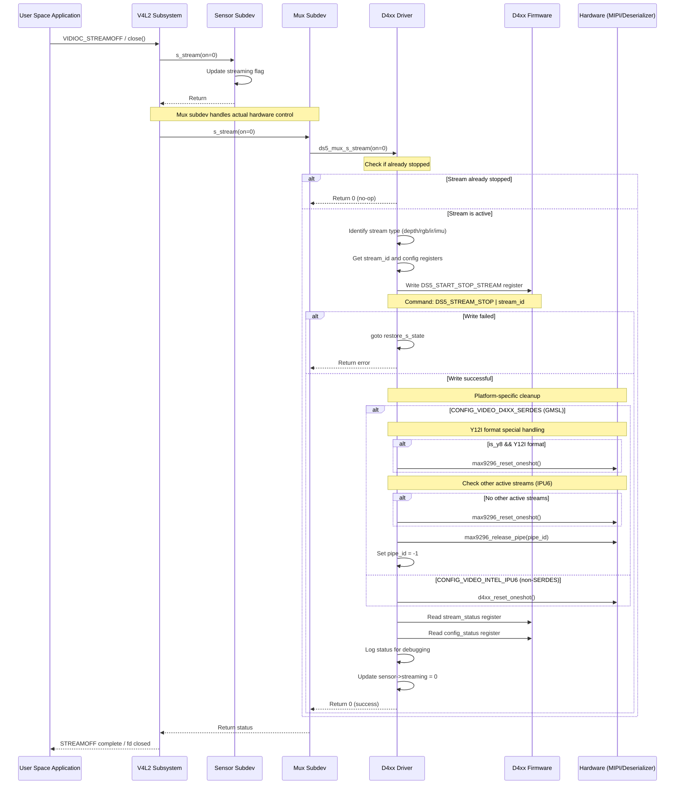

# D4xx Stream Stop Flow Documentation

## Table of Contents
1. [Introduction](#introduction)
2. [High Level Design](#high-level-design)
3. [Low Level Design](#low-level-design)
4. [Integration Points](#integration-points)
5. [Error Handling and Edge Cases](#error-handling-and-edge-cases)
6. [References](#references)

---

## Introduction

### Purpose
This document describes the complete flow for stopping a video stream in the Intel® RealSense™ D4xx driver (`kernel/realsense/d4xx.c`). The stream stop mechanism is a critical component of the driver that ensures proper cleanup of hardware resources, termination of data transmission, and synchronization between the V4L2 subsystem and the D4xx camera firmware.

### Context
The D4xx driver supports multiple stream types:
- **Depth Stream** (DS5_STREAM_DEPTH): Z16 depth data
- **RGB Stream** (DS5_STREAM_RGB): Color camera data
- **IR Stream** (DS5_STREAM_IR): Infrared data (Y8/Y16/Y12I formats)
- **IMU Stream** (DS5_STREAM_IMU): Inertial measurement unit data

Each stream can be independently started and stopped through the V4L2 API. The stop flow ensures that:
1. The firmware is notified to halt data transmission
2. Hardware resources (MIPI CSI-2 pipelines, deserializer channels) are properly released
3. Driver state is correctly updated to prevent resource leaks
4. The system is ready for subsequent stream operations

---

## High Level Design

### Overview
The stream stop flow is triggered when user-space applications:
1. Issue a `VIDIOC_STREAMOFF` ioctl to a video device node
2. Close the video device file descriptor
3. Terminate the streaming application

The driver handles these requests through a series of coordinated steps involving the V4L2 subsystem, the D4xx driver, and the camera hardware.

### Sequence Diagram



### Major Components

1. **V4L2 Subsystem**: Linux kernel video framework that provides standard APIs for video devices
2. **Sensor Subdevices**: Individual subdevices for each stream type (depth, RGB, IR, IMU)
3. **Mux Subdevice**: Multiplexer that coordinates stream control and hardware access
4. **D4xx Driver Core**: Main driver logic that communicates with firmware via I2C
5. **Firmware Interface**: Register-based interface for controlling camera firmware
6. **Hardware Layer**: MIPI CSI-2 interface and optional GMSL deserializer (MAX9296)

---

## Low Level Design

### Key Data Structures

#### 1. `struct ds5_sensor`
Located at line 397-412, represents an individual sensor/stream:
```c
struct ds5_sensor {
    struct v4l2_subdev sd;              // V4L2 subdevice
    struct media_pad pad;               // Media pad for linking
    struct v4l2_mbus_framefmt format;   // Current format
    u16 mux_pad;                        // Mux pad number
    struct {
        const struct ds5_format *format;      // Configured format
        const struct ds5_resolution *resolution; // Configured resolution
        u16 framerate;                        // Frame rate
    } config;
    bool streaming;                     // Streaming state flag
    const struct ds5_format *formats;   // Supported formats
    unsigned int n_formats;             // Number of formats
    int pipe_id;                        // GMSL pipe ID (SERDES mode)
};
```

#### 2. `struct ds5`
Located at line 451-490, main driver state structure containing all sensors and control state.

### Key Registers

#### Stream Control Registers (lines 77-90)
```c
#define DS5_START_STOP_STREAM       0x1000  // Main stream control register
#define DS5_DEPTH_STREAM_STATUS     0x1004  // Depth stream status
#define DS5_RGB_STREAM_STATUS       0x1008  // RGB stream status
#define DS5_IMU_STREAM_STATUS       0x100C  // IMU stream status
#define DS5_IR_STREAM_STATUS        0x1014  // IR stream status

// Stream type identifiers
#define DS5_STREAM_DEPTH            0x0
#define DS5_STREAM_RGB              0x1
#define DS5_STREAM_IMU              0x2
#define DS5_STREAM_IR               0x4

// Stream commands
#define DS5_STREAM_STOP             0x100
#define DS5_STREAM_START            0x200

// Stream states
#define DS5_STREAM_IDLE             0x1
#define DS5_STREAM_STREAMING        0x2
```

#### Configuration Status Registers (lines 132-140)
```c
#define DS5_DEPTH_CONFIG_STATUS     0x4800  // Depth config status
#define DS5_RGB_CONFIG_STATUS       0x4802  // RGB config status
#define DS5_IMU_CONFIG_STATUS       0x4804  // IMU config status
#define DS5_IR_CONFIG_STATUS        0x4808  // IR config status

// Status flags
#define DS5_STATUS_STREAMING        0x1     // Stream is active
#define DS5_STATUS_INVALID_DT       0x2     // Invalid data type
#define DS5_STATUS_INVALID_RES      0x4     // Invalid resolution
#define DS5_STATUS_INVALID_FPS      0x8     // Invalid frame rate
```

### Core Functions

#### 1. `ds5_mux_s_stream()` (lines 4342-4506)
**Purpose**: Main entry point for stream control, handles both start and stop operations.

**Location**: `kernel/realsense/d4xx.c:4342`

**Function Flow for Stream Stop (on=0)**:

```
ds5_mux_s_stream(sd, on=0)
├─ Get state from subdev
├─ Check if sensor->streaming == on (skip duplicate calls)
├─ Determine stream type and set:
│  ├─ config_status_base register address
│  ├─ stream_status_base register address
│  ├─ stream_id (DEPTH/RGB/IR/IMU)
│  └─ vc_id (virtual channel)
│
├─ Save current streaming state (restore_val)
├─ Update sensor->streaming = 0
│
└─ Stop sequence (on == 0):
   ├─ Write DS5_START_STOP_STREAM register
   │  └─ Value: DS5_STREAM_STOP | stream_id
   │
   ├─ If write fails: goto restore_s_state
   │
   ├─ Platform-specific cleanup:
   │  │
   │  ├─ CONFIG_VIDEO_D4XX_SERDES (GMSL/MAX9296):
   │  │  ├─ If Y12I format (RGB_888 data type):
   │  │  │  └─ max9296_reset_oneshot(dser_dev)
   │  │  │
   │  │  ├─ For IPU6 (non-Tegra):
   │  │  │  ├─ Check d4xx_set_sub_stream array
   │  │  │  ├─ If no other streams active:
   │  │  │  │  └─ max9296_reset_oneshot(dser_dev)
   │  │  │
   │  │  ├─ max9296_release_pipe(dser_dev, pipe_id)
   │  │  └─ sensor->pipe_id = -1
   │  │
   │  └─ CONFIG_VIDEO_INTEL_IPU6 (non-SERDES):
   │     └─ d4xx_reset_oneshot(state)
   │
   ├─ Read status registers for logging:
   │  ├─ ds5_read(config_status_base, &status)
   │  └─ ds5_read(stream_status_base, &streaming)
   │
   └─ Return 0 (success)

restore_s_state (error path):
├─ If SERDES and pipe_id >= 0:
│  └─ max9296_release_pipe(dser_dev, pipe_id)
├─ Read config_status for error logging
├─ Restore sensor->streaming = restore_val
└─ Return error code
```

**Key Parameters**:
- `sd`: V4L2 subdevice pointer
- `on`: 1 for start, 0 for stop

**Return Values**:
- `0`: Success
- `-EINVAL`: Invalid stream type
- `-EAGAIN`: Operation failed, retry possible
- `< 0`: I2C communication error

#### 2. `ds5_sensor_s_stream()` (lines 1820-1830)
**Purpose**: Simple sensor-level stream control handler.

**Function**: Updates the sensor's streaming flag. The actual hardware control is delegated to the mux subdevice.

```c
static int ds5_sensor_s_stream(struct v4l2_subdev *sd, int on)
{
    struct ds5_sensor *sensor = container_of(sd, struct ds5_sensor, sd);
    
    dev_dbg(sensor->sd.dev, "%s(): sensor: name=%s state=%d\n",
        __func__, sensor->sd.name, on);
    
    sensor->streaming = on;
    
    return 0;
}
```

#### 3. `ds5_mux_close()` (lines 3059-3068)
**Purpose**: Cleanup when V4L2 subdevice is closed.

**Function**: Decrements the device open count. Used for tracking how many file descriptors are open.

```c
static int ds5_mux_close(struct v4l2_subdev *sd, struct v4l2_subdev_fh *fh)
{
    struct ds5 *state = v4l2_get_subdevdata(sd);
    
    dev_dbg(sd->dev, "%s(): %s (%p)\n", __func__, sd->name, fh);
    mutex_lock(&state->lock);
    state->dfu_dev.device_open_count--;
    mutex_unlock(&state->lock);
    return 0;
}
```

#### 4. Hardware-Specific Functions

##### `max9296_release_pipe()` (GMSL/SERDES mode)
**Purpose**: Releases a MIPI CSI-2 pipeline in the MAX9296 deserializer.

**Context**: Called during stream stop to free the hardware pipeline that was allocated during stream start.

**Parameters**:
- `dser_dev`: Deserializer device pointer
- `pipe_id`: Pipeline ID to release (0-3)

##### `max9296_reset_oneshot()` (GMSL/SERDES mode)
**Purpose**: Performs a one-shot reset of the MAX9296 deserializer data path.

**When Called**:
- After stopping Y12I (RGB_888 data type) IR streams
- When all streams are stopped (IPU6 platform only)

**Note**: This reset is necessary to clear the deserializer state for certain data formats.

##### `d4xx_reset_oneshot()` (line 4302, IPU6 non-SERDES mode)
**Purpose**: Performs platform-specific reset for Intel IPU6 platforms without GMSL.

**Implementation**: Platform-specific reset mechanism for direct MIPI connections.

### Register Access

#### Write Operation
```c
ds5_write(state, DS5_START_STOP_STREAM, DS5_STREAM_STOP | stream_id)
```
- **Address**: 0x1000
- **Value**: 0x100 (STOP) | stream_id (0/1/2/4)
- **Examples**:
  - Depth stop: 0x100
  - RGB stop: 0x101
  - IMU stop: 0x102
  - IR stop: 0x104

#### Read Operations
Status verification after stop command:
```c
ds5_read(state, stream_status_base, &streaming);
ds5_read(state, config_status_base, &status);
```

### State Transitions

```
[STREAMING (streaming=1)]
        |
        | VIDIOC_STREAMOFF / close()
        v
[Write STOP Command to FW]
        |
        v
[Hardware Cleanup]
        |
        ├─ Release GMSL pipe (if applicable)
        ├─ Reset deserializer (if needed)
        └─ Reset IPU6 (if applicable)
        |
        v
[Update State: streaming=0]
        |
        v
[IDLE (streaming=0)]
```

---

## Integration Points

### 1. V4L2 Subsystem Integration

**Video Operations Structure** (line 1832-1836):
```c
static const struct v4l2_subdev_video_ops ds5_sensor_video_ops = {
    .g_frame_interval = ds5_sensor_g_frame_interval,
    .s_frame_interval = ds5_sensor_s_frame_interval,
    .s_stream         = ds5_sensor_s_stream,
};
```

**Subdevice Operations** (lines 4542-4545):
```c
static const struct v4l2_subdev_video_ops ds5_mux_video_ops = {
    .s_stream = ds5_mux_s_stream,
};
```

**Internal Operations** (lines 3070-3073):
```c
static const struct v4l2_subdev_internal_ops ds5_sensor_internal_ops = {
    .open  = ds5_mux_open,
    .close = ds5_mux_close,
};
```

### 2. Device Tree Integration

**Device Tree Files** (located in `hardware/realsense/`):
- `tegra194-camera-d4xx.dtsi`: Base D4xx camera definitions
- `tegra194-camera-d4xx-single.dtsi`: Single camera configuration
- `tegra194-camera-d4xx-dual.dtsi`: Dual camera configuration
- `tegra234-camera-d4xx-overlay.dts`: Orin (Tegra234) overlay
- `tegra234-camera-d4xx-overlay-dual.dts`: Orin dual camera overlay

**Key Device Tree Properties**:
- I2C address and bus configuration
- GMSL deserializer (MAX9296) properties
- GMSL serializer (MAX9295) properties
- MIPI CSI-2 lane configuration
- Virtual channel assignments

### 3. Platform-Specific Integrations

#### NVIDIA Tegra Platform (`CONFIG_TEGRA_CAMERA_PLATFORM`)
**Camera Common Data Structure** (line 414-416):
```c
#ifdef CONFIG_TEGRA_CAMERA_PLATFORM
#include <media/camera_common.h>
#define ds5_mux_subdev camera_common_data
#endif
```

**Integration Points**:
- Tegra VI (Video Input) driver
- Tegra CSI driver (NVCSI)
- Tegra camera RTCPU firmware

#### Intel IPU6 Platform (`CONFIG_VIDEO_INTEL_IPU6`)
**Platform Data** (line 34-36):
```c
#ifdef CONFIG_VIDEO_INTEL_IPU6
#include <linux/ipu-isys.h>
#include <media/d4xx_pdata.h>
#endif
```

**Integration Points**:
- Intel IPU6 ISYS (Image System)
- Direct MIPI CSI-2 connection (no GMSL)
- Platform-specific reset mechanism

#### GMSL/SERDES Platform (`CONFIG_VIDEO_D4XX_SERDES`)
**SerDes Headers** (lines 43-52):
```c
#ifdef CONFIG_VIDEO_D4XX_SERDES
#include <media/max9295.h>
#include <media/max9296.h>
#else
#include <media/gmsl-link.h>
#endif
```

**Integration Points**:
- MAX9295 serializer (camera side)
- MAX9296 deserializer (host side)
- GMSL link management
- Pipeline allocation/release

### 4. User-Space API Integration

**V4L2 IOCTLs**:
- `VIDIOC_STREAMOFF`: Primary method to stop streaming
- `VIDIOC_REQBUFS` (count=0): Implicitly stops streaming
- File descriptor `close()`: Triggers cleanup path

**Video Device Nodes** (typical setup):
- `/dev/video0`: Depth stream
- `/dev/video1`: Depth metadata
- `/dev/video2`: RGB stream
- `/dev/video3`: RGB metadata
- `/dev/video4`: IR stream
- `/dev/video5`: IMU stream

**Example User-Space Code**:
```c
// Stop streaming using VIDIOC_STREAMOFF
enum v4l2_buf_type type = V4L2_BUF_TYPE_VIDEO_CAPTURE;
ioctl(fd, VIDIOC_STREAMOFF, &type);

// Or simply close the device
close(fd);
```

### 5. Firmware Interface

**Communication Protocol**:
- I2C-based register interface
- 16-bit register addresses
- 16-bit register values (mostly)
- Regmap abstraction layer

**Command Sequence**:
1. Write command to `DS5_START_STOP_STREAM` (0x1000)
2. Read status from stream-specific status register
3. Verify completion via config status register

**Firmware States**:
- `DS5_STREAM_IDLE` (0x1): Stream stopped
- `DS5_STREAM_STREAMING` (0x2): Stream active

---

## Error Handling and Edge Cases

### 1. Duplicate Stop Requests

**Detection** (line 4353-4354):
```c
if (sensor->streaming == on)
    return 0;
```

**Behavior**: If a stop request is received when the stream is already stopped, the function returns immediately without issuing hardware commands. This prevents unnecessary I2C transactions and potential hardware state corruption.

### 2. I2C Communication Failures

**Error Path** (lines 4444-4445, 4489-4505):
```c
ret = ds5_write(state, DS5_START_STOP_STREAM, DS5_STREAM_STOP | stream_id);
if (ret < 0)
    goto restore_s_state;
```

**Recovery**:
1. Jump to `restore_s_state` label
2. Release GMSL pipe if allocated
3. Read config status for diagnostics
4. Restore original streaming state
5. Return error to caller

**Impact**: The sensor remains in its previous state. User-space should retry or handle the error appropriately.

### 3. GMSL Pipe Release Failures

**Handling** (lines 4468-4469, 4492-4493):
```c
if (max9296_release_pipe(state->dser_dev, sensor->pipe_id) < 0)
    dev_warn(&state->client->dev, "release pipe failed\n");
```

**Behavior**: 
- Warning logged but does not fail the stop operation
- Pipe ID is reset to -1 to prevent double-release
- System continues with stop sequence

**Rationale**: Hardware resource cleanup is best-effort; the stream is already stopped from the firmware perspective.

### 4. Y12I Format Special Handling

**Detection** (lines 4449-4453):
```c
if (state->is_y8 && 
    state->ir.sensor.config.format->data_type == GMSL_CSI_DT_RGB_888) {
    max9296_reset_oneshot(state->dser_dev);
}
```

**Reason**: Y12I format (represented as RGB_888 for GMSL) requires deserializer reset after streaming stops to properly clear the data path state.

**Impact**: Without this reset, subsequent stream starts with different formats may fail or produce corrupted data.

### 5. Multi-Stream Coordination (IPU6 Platform)

**Detection** (lines 4456-4467):
```c
streaming = 0;
for (i = 0; i < ARRAY_SIZE(d4xx_set_sub_stream); i++) {
    if (d4xx_set_sub_stream[i]) {
        streaming = 1;
        break;
    }
}
if (!streaming) {
    max9296_reset_oneshot(state->dser_dev);
}
```

**Purpose**: On IPU6 platforms, track whether any streams are still active across multiple D4xx devices. Only reset the deserializer when all streams are stopped.

**Synchronization**: Uses global `d4xx_set_sub_stream[]` array to track active streams.

### 6. State Restoration on Error

**Implementation** (lines 4389, 4503):
```c
restore_val = sensor->streaming;  // Save before changing
// ... operation ...
restore_s_state:
    sensor->streaming = restore_val;  // Restore on error
```

**Purpose**: Ensures driver state remains consistent with hardware state if stop operation fails.

**Importance**: Prevents state machine corruption that could cause subsequent operations to behave incorrectly.

### 7. Timeout Handling

**Note**: Unlike stream start (which polls for completion with timeout), stream stop does not wait for firmware acknowledgment.

**Rationale**:
- Stop commands are typically processed quickly by firmware
- Blocking on stop could delay application shutdown
- Status is logged for debugging but not enforced

### 8. Concurrency Protection

**Mutex Locking**: The `ds5_mux_s_stream()` function relies on upper layers (V4L2 subsystem) for serialization. The driver uses `state->lock` mutex in other contexts (e.g., `ds5_mux_close()`).

**Thread Safety**: Multiple simultaneous stop requests on different streams are safe due to:
- Independent sensor state per stream type
- Atomic hardware operations
- Upper-layer serialization

### 9. Resource Leak Prevention

**Pipe ID Management**:
```c
sensor->pipe_id = -1;  // Always reset after release
```

**Purpose**: Ensures pipe IDs are not reused or double-freed.

**Validation**: On stream start, pipe_id is checked to be -1 before allocation.

### 10. Edge Case: Rapid Start/Stop Cycles

**Protection**: The duplicate call check (line 4353) prevents firmware command queue overflow from rapid start/stop cycles.

**Limitation**: No explicit debouncing or rate limiting. Applications should avoid excessive start/stop cycles as this can stress the firmware and hardware.

### 11. Platform Configuration Errors

**Symptom**: If device tree or platform data is misconfigured, stream stop may fail silently or incompletely.

**Debugging**:
- Enable driver debug messages: `echo 8 > /proc/sys/kernel/printk`
- Check dmesg for error messages
- Verify device tree bindings
- Check I2C communication with `i2cdump`

### 12. Firmware Version Compatibility

**Consideration**: Different firmware versions may have slightly different register layouts or timing requirements.

**Mitigation**: 
- Driver reads firmware version during probe
- Version information logged during initialization
- Critical for debugging customer issues

---

## References

### Source Code Files
- **Main Driver**: `kernel/realsense/d4xx.c`
  - Stream stop function: `ds5_mux_s_stream()` (line 4342)
  - Sensor stream control: `ds5_sensor_s_stream()` (line 1820)
  - Subdev close: `ds5_mux_close()` (line 3059)
  - Register definitions: Lines 77-140
  - Data structures: Lines 397-490

### Device Tree Files
Located in `hardware/realsense/`:
- `tegra194-camera-d4xx.dtsi`
- `tegra194-camera-d4xx-single.dtsi`
- `tegra194-camera-d4xx-dual.dtsi`
- `tegra234-camera-d4xx-overlay.dts`
- `tegra234-camera-d4xx-overlay-dual.dts`

### Documentation Files
- `README.md`: Main repository documentation
- `README_driver.md`: Driver API documentation
- `README_JP6.md`: JetPack 6.x setup guide
- `README_JP5.md`: JetPack 5.x setup guide
- `README_JP4.md`: JetPack 4.6.1 setup guide
- `README_tools.md`: Build tools manual

### External References

#### V4L2 Documentation
- [Linux V4L2 API](https://www.kernel.org/doc/html/latest/userspace-api/media/v4l/v4l2.html)
- [V4L2 Subdev API](https://www.kernel.org/doc/html/latest/driver-api/media/v4l2-subdev.html)
- [V4L2 Video Streaming](https://www.kernel.org/doc/html/latest/userspace-api/media/v4l/vidioc-streamon.html)

#### NVIDIA Tegra Documentation
- [Jetson Virtual Channel with GMSL](https://docs.nvidia.com/jetson/archives/r35.1/DeveloperGuide/text/SD/CameraDevelopment/JetsonVirtualChannelWithGmslCameraFramework.html)
- [Tegra Camera Architecture](https://docs.nvidia.com/jetson/l4t-multimedia/group__LibargusAPI.html)

#### GMSL/SerDes Documentation
- MAX9296 Deserializer Datasheet (Maxim Integrated)
- MAX9295 Serializer Datasheet (Maxim Integrated)
- GMSL2 Protocol Specification

#### Intel IPU Documentation
- Intel IPU6 ISYS Documentation
- Intel RealSense D400 Series Datasheet

### Related Standards
- **MIPI CSI-2**: Camera Serial Interface specification
- **I2C**: Inter-Integrated Circuit protocol
- **V4L2**: Video for Linux 2 API standard

### Hardware Components
- **Intel RealSense D457**: MIPI camera module
- **DES457**: De-serializer board
- **MAX9296**: GMSL2 4-channel deserializer
- **MAX9295**: GMSL2 serializer
- **NVIDIA Jetson AGX Xavier**: Tegra194 platform
- **NVIDIA Jetson AGX Orin**: Tegra234 platform

### Glossary
- **CSI-2**: Camera Serial Interface 2 (MIPI standard)
- **DFU**: Device Firmware Update
- **GMSL**: Gigabit Multimedia Serial Link
- **IMU**: Inertial Measurement Unit
- **IR**: Infrared
- **MIPI**: Mobile Industry Processor Interface
- **SerDes**: Serializer/Deserializer
- **V4L2**: Video for Linux 2
- **VC**: Virtual Channel

---

## Revision History

| Version | Date | Author | Description |
|---------|------|--------|-------------|
| 1.0 | 2024 | D4xx Driver Team | Initial documentation of stream stop flow |

---

**Document Status**: Complete  
**Maintenance**: This document should be updated when significant changes are made to the stream stop logic in `d4xx.c`.
