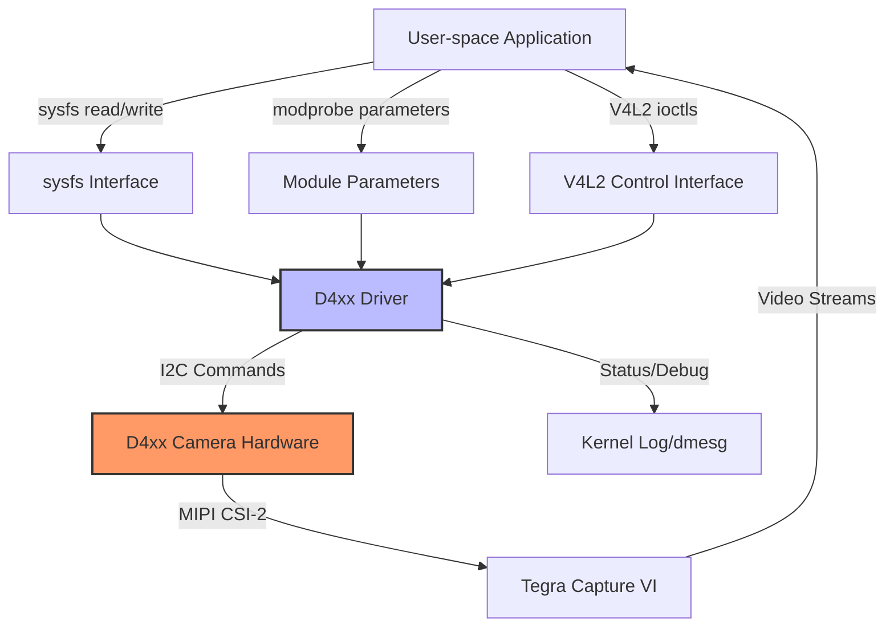

# Intel® RealSense™ D4xx Driver - Controls Overview

# D457 MIPI Driver Controls and Configuration API

### Links
- Intel® RealSense™ camera driver for GMSL* interface [Front Page](./README.md)
- NVIDIA® Jetson AGX Orin™ board setup - AGX Orin™ [JetPack 6.x](./README_JP6.md) setup guide
- NVIDIA® Jetson AGX Xavier™ board setup - AGX Xavier™ [JetPack 5.x.2](./README_JP5.md) setup guide
- NVIDIA® Jetson AGX Xavier™ board setup - AGX Xavier™ [JetPack 4.6.1](./README_JP4.md) setup guide
- Build Tools manual page [Build Manual page](./README_tools.md)
- Driver API manual page [Driver API page](./README_driver.md)

## Introduction

This document provides a comprehensive overview of all controls available in the RealSense D4xx driver (`kernel/realsense/d4xx.c`). These controls enable developers and system integrators to:

- Configure camera parameters at runtime
- Access device information and diagnostics
- Perform calibration and advanced configuration
- Debug and troubleshoot hardware and driver issues
- Integrate the driver with custom applications

The D4xx driver exposes controls through multiple interfaces:
- **sysfs attributes** - File-based interface for reading device information and register access
- **Module parameters** - Kernel module configuration options set at load time
- **V4L2 controls** - Standard Video4Linux2 API for camera parameter control

## High Level Design

### Control Flow Architecture

The following diagram illustrates how user-space applications interact with the D4xx driver to control the hardware:



### Interface Overview

| Interface Type | Access Method | Use Cases | Persistence |
|---------------|---------------|-----------|-------------|
| **sysfs** | File operations (read/write) | Device info, register debugging, firmware version | Runtime only |
| **Module Parameters** | modprobe/insmod arguments | Hardware topology, I2C addressing, virtual channel mapping | Set at module load time |
| **V4L2 Controls** | ioctl() calls via V4L2 API | Camera settings (exposure, gain), calibration, streaming config | Runtime adjustable |

## Low Level Design

### 1. sysfs Attributes

The driver exposes several sysfs attributes under `/sys/bus/i2c/drivers/d4xx/<device>/` where `<device>` is the I2C device identifier (e.g., `9-001a`, `12-001a`).

#### 1.1 Firmware Version (`ds5_fw_ver`)

**Purpose:** Display the firmware version and sensor type of the connected D4xx camera.

**Access:** Read-only

**Location:** `/sys/bus/i2c/drivers/d4xx/<device>/ds5_fw_ver`

**Format:** `D4XX Sensor: <TYPE>, Version: <major>.<minor>.<patch>.<build>`

**Example:**
```bash
# Read firmware version
cat /sys/bus/i2c/drivers/d4xx/9-001a/ds5_fw_ver

# Expected output:
# D4XX Sensor: DEPTH, Version: 5.15.1.0
```

**Code Reference:** `d4xx.c:5526-5542`

**Implementation Details:**
- Reads from registers `DS5_FW_VERSION` (0x0300) and `DS5_FW_BUILD` (0x030C)
- Sensor type determined by device configuration
- Version format: `(major.minor.patch.build)`

---

#### 1.2 Read Register (`ds5_read_reg`)

**Purpose:** Read arbitrary hardware registers for debugging and diagnostics.

**Access:** Read/Write (write to specify register, read to get value)

**Location:** `/sys/bus/i2c/drivers/d4xx/<device>/ds5_read_reg`

**Format:** 
- Write: `0x<register_address>` (hex format)
- Read: `register:0x<address>, value:0x<value>`

**Example:**
```bash
# Specify register to read (e.g., 0xc03c)
echo -n "0xc03c" | sudo tee /sys/bus/i2c/drivers/d4xx/9-001a/ds5_read_reg

# Read register value
cat /sys/bus/i2c/drivers/d4xx/9-001a/ds5_read_reg

# Expected output:
# register:0xc03c, value:0x11
```

**Code Reference:** `d4xx.c:5561-5608`

**Implementation Details:**
- Two-step process: write register address, then read value
- Register address validated before access
- Uses internal I2C read mechanism
- Useful for firmware debugging and reverse engineering

**Common Registers:**
| Address | Description |
|---------|-------------|
| 0x0300 | Firmware version (high) |
| 0x030C | Firmware build number |
| 0x4900 | HWMC data register |
| 0x4904 | HWMC status register |

---

#### 1.3 Write Register (`ds5_write_reg`)

**Purpose:** Write to hardware registers for debugging and advanced configuration.

**Access:** Write-only

**Location:** `/sys/bus/i2c/drivers/d4xx/<device>/ds5_write_reg`

**Format:** `0x<register_address> 0x<value>`

**Example:**
```bash
# Write value 0x0100 to register 0x1000
echo "0x1000 0x0100" | sudo tee /sys/bus/i2c/drivers/d4xx/9-001a/ds5_write_reg
```

**Code Reference:** `d4xx.c:5610-5631`

**Implementation Details:**
- Direct register write access
- No validation of register addresses or values
- **WARNING:** Incorrect values can damage hardware or corrupt firmware state
- Use with caution and refer to hardware documentation

**Safety Notes:**
- ⚠️ This is a low-level debugging interface
- ⚠️ Improper use can cause device malfunction
- ⚠️ Only use if you have detailed register documentation

---

### 2. Module Parameters

Module parameters configure the driver at load time and define the hardware topology. These are particularly important for multi-camera setups and deserializer configurations.

#### 2.1 Sensor Virtual Channels (`sensor_vc`)

**Purpose:** Map sensor streams to MIPI CSI-2 virtual channels.

**Type:** Array of unsigned short integers

**Default:** `{0, 1, 2, 3, 2, 3, 0, 1}`

**Access:** Read-only (set at module load)

**Scope:** Intel IPU6 configurations only (`CONFIG_VIDEO_INTEL_IPU6`)

**Format:** 8 values representing VC assignments for sensor streams

**Stream Mapping:**
| Index | Stream Type | Default VC |
|-------|-------------|------------|
| 0 | Depth | 0 |
| 1 | Depth Metadata | 1 |
| 2 | RGB | 2 |
| 3 | RGB Metadata | 3 |
| 4 | IR | 2 |
| 5 | IR Metadata | 3 |
| 6 | IMU | 0 |
| 7 | IMU Metadata | 1 |

**Example:**
```bash
# Load module with custom VC mapping
sudo modprobe d4xx sensor_vc=0,1,2,3,2,3,0,1

# View current setting
cat /sys/module/d4xx/parameters/sensor_vc
```

**Code Reference:** `d4xx.c:3464-3467`

**Configuration Notes:**
- Each sensor stream requires a unique VC or can share with metadata
- Virtual channels 0-3 are typically available
- Coordinate with CSI-2 receiver configuration

---

#### 2.2 Deserializer I2C Bus (`serdes_bus`)

**Purpose:** Specify I2C bus numbers for MAX9295/MAX9296 deserializer chips.

**Type:** Array of unsigned short integers (4 elements)

**Default:** 
- Standard platforms: `{2, 2, 4, 4}`
- Axiomtek platform: `{5, 5, 5, 5}`

**Access:** Read-only (set at module load)

**Scope:** Intel IPU6 configurations only

**Format:** 4 values for up to 4 cameras/deserializers

**Example:**
```bash
# Load module with custom bus configuration
sudo modprobe d4xx serdes_bus=2,2,4,4

# View current setting
cat /sys/module/d4xx/parameters/serdes_bus
```

**Code Reference:** `d4xx.c:3469-3477`

**Configuration Notes:**
- Bus numbers must match your system's I2C topology
- Verify with `i2cdetect` before configuring
- Different platforms may require different mappings

---

#### 2.3 Deserializer I2C Address (`des_addr`)

**Purpose:** Set I2C addresses for MAX9296 deserializer chips.

**Type:** Array of unsigned short integers (4 elements)

**Default:**
- Standard platforms: `{0x48, 0x4a, 0x48, 0x4a}`
- Axiomtek platform: `{0x48, 0x4a, 0x68, 0x6c}`

**Access:** Read-only (set at module load)

**Scope:** Intel IPU6 configurations only

**Format:** 4 I2C addresses (7-bit format)

**Example:**
```bash
# Load module with custom addresses
sudo modprobe d4xx des_addr=0x48,0x4a,0x48,0x4a

# View current setting
cat /sys/module/d4xx/parameters/des_addr
```

**Code Reference:** `d4xx.c:3479-3487`

**Valid Addresses:**
- 0x48 (default)
- 0x4a (default)
- 0x68 (Axiomtek)
- 0x6c (Axiomtek)

---

### 3. V4L2 Controls

V4L2 controls provide the primary runtime interface for camera parameter adjustment. These are accessed through standard V4L2 ioctls (VIDIOC_G_CTRL, VIDIOC_S_CTRL, VIDIOC_G_EXT_CTRLS, VIDIOC_S_EXT_CTRLS).

#### 3.1 Standard V4L2 Controls

##### 3.1.1 Analog Gain (`V4L2_CID_ANALOGUE_GAIN`)

**Purpose:** Control sensor analog gain for brightness adjustment.

**Type:** Integer

**Range:**
- Depth/IR sensors: 16-248 (default: 16)
- RGB sensor: 0-128 (default: 64)

**Units:** Sensor-specific units

**Example:**
```bash
# Using v4l2-ctl to set gain on depth camera (video0)
v4l2-ctl -d /dev/video0 -c analogue_gain=32

# Query current gain value
v4l2-ctl -d /dev/video0 -C analogue_gain
```

**Code Reference:** `d4xx.c:2173-2176, 3643-3650`

**Notes:**
- Not available for IMU streams
- Higher values increase sensitivity but may introduce noise
- Interacts with auto-exposure when enabled

---

##### 3.1.2 Exposure Auto (`V4L2_CID_EXPOSURE_AUTO`)

**Purpose:** Enable or disable automatic exposure control.

**Type:** Menu (enumeration)

**Values:**
- `V4L2_EXPOSURE_AUTO` (0) - Full auto
- `V4L2_EXPOSURE_MANUAL` (1) - Manual mode
- `V4L2_EXPOSURE_SHUTTER_PRIORITY` (2) - Shutter priority
- `V4L2_EXPOSURE_APERTURE_PRIORITY` (3) - Aperture priority

**Default:** Varies by sensor

**Example:**
```bash
# Enable auto exposure
v4l2-ctl -d /dev/video0 -c exposure_auto=0

# Disable auto exposure (manual mode)
v4l2-ctl -d /dev/video0 -c exposure_auto=1
```

**Code Reference:** `d4xx.c:2177-2180, 3659-3673`

**Notes:**
- Not available for IMU streams
- When auto is enabled, manual exposure setting may be ignored
- RGB sensor supports additional modes

---

##### 3.1.3 Exposure Absolute (`V4L2_CID_EXPOSURE_ABSOLUTE`)

**Purpose:** Set manual exposure time.

**Type:** Integer

**Range:**
- Depth/IR sensors: 1-200000 (default: 33000)
- RGB sensor: 1-200000 (default: 33000)

**Units:** Microseconds (μs)

**Example:**
```bash
# Set exposure to 10ms (10000 μs)
v4l2-ctl -d /dev/video0 -c exposure_absolute=10000

# Query current exposure
v4l2-ctl -d /dev/video0 -C exposure_absolute
```

**Code Reference:** `d4xx.c:2181-2183, 3675-3690`

**Notes:**
- Only effective when auto-exposure is disabled
- Longer exposures increase light sensitivity but reduce frame rate
- Not available for IMU streams

---

#### 3.2 Custom D4xx Controls

The driver implements extensive custom controls for advanced features. All custom controls use the base ID `DS5_CAMERA_CID_BASE`, which is defined as `(V4L2_CTRL_CLASS_CAMERA | DS5_DEPTH_STREAM_DT)` = `(0x009A0000 | 0x4000)` = `0x009A4000`.

**Note:** To use custom controls with v4l2-ctl, you'll need to calculate the full control ID. For example:
- `DS5_CAMERA_CID_LASER_POWER` = `DS5_CAMERA_CID_BASE + 1` = `0x009A4001`

##### 3.2.1 Laser Power (`DS5_CAMERA_CID_LASER_POWER`)

**Purpose:** Enable or disable the active IR projector.

**Type:** Boolean

**Range:** 0 (off) - 1 (on)

**Default:** 1 (on)

**Flags:** Volatile, Execute-on-write

**Example:**
```bash
# Using v4l2-ctl with custom control ID
# Note: Control ID is (V4L2_CTRL_CLASS_CAMERA | 0x1000) + 1

# Disable laser
v4l2-ctl -d /dev/video0 -c laser_power=0

# Enable laser
v4l2-ctl -d /dev/video0 -c laser_power=1
```

**Code Reference:** `d4xx.c:2184-2188, 2797-2807`

**Notes:**
- Affects depth quality in low-light conditions
- Disabling saves power but may degrade depth quality
- IR pattern visible to IR-sensitive cameras

---

##### 3.2.2 Manual Laser Power (`DS5_CAMERA_CID_MANUAL_LASER_POWER`)

**Purpose:** Fine-tune laser power level.

**Type:** Integer

**Range:** 0-360, step: 30

**Default:** 150

**Units:** Hardware-specific power units

**Flags:** Volatile, Execute-on-write

**Example:**
```bash
# Set laser power to maximum
v4l2-ctl -d /dev/video0 -c manual_laser_power=360

# Set laser power to minimum
v4l2-ctl -d /dev/video0 -c manual_laser_power=0
```

**Code Reference:** `d4xx.c:2189-2250, 2809-2819`

**Notes:**
- Allows granular control over IR projector intensity
- May affect depth range and quality
- Higher power = better range but more power consumption

---

##### 3.2.3 Firmware Version (`DS5_CAMERA_CID_FW_VERSION`)

**Purpose:** Query firmware version programmatically.

**Type:** U32 array (1 element)

**Access:** Read-only, Volatile

**Example:**
```c
// C API example
struct v4l2_ext_control ctrl = {0};
struct v4l2_ext_controls ctrls = {0};

ctrl.id = DS5_CAMERA_CID_FW_VERSION;
ctrl.size = sizeof(u32);
ctrl.p_u32 = &version;

ctrls.count = 1;
ctrls.controls = &ctrl;

ioctl(fd, VIDIOC_G_EXT_CTRLS, &ctrls);
printf("Firmware version: 0x%08x\n", version);
```

**Code Reference:** `d4xx.c:2679-2684, 2821-2830`

**Return Format:** 32-bit value containing version information

---

##### 3.2.4 Hardware Monitor Control (`DS5_CAMERA_CID_HWMC`)

**Purpose:** Access hardware monitoring and control interface.

**Type:** U8 array (DS5_HWMC_BUFFER_SIZE + 4 bytes)

**Access:** Read/Write

**Buffer Size:** Defined by `DS5_HWMC_BUFFER_SIZE` constant

**Example:**
```c
// Send HWMC command
u8 cmd_buffer[DS5_HWMC_BUFFER_SIZE + 4];
struct v4l2_ext_control ctrl = {0};
struct v4l2_ext_controls ctrls = {0};

// Prepare command in cmd_buffer
// ...

ctrl.id = DS5_CAMERA_CID_HWMC;
ctrl.size = sizeof(cmd_buffer);
ctrl.p_u8 = cmd_buffer;

ctrls.count = 1;
ctrls.controls = &ctrl;

ioctl(fd, VIDIOC_S_EXT_CTRLS, &ctrls);
```

**Code Reference:** `d4xx.c:2388-2405, 2965-2977`

**Related Controls:**
- `DS5_CAMERA_CID_HWMC_RW` - UVC-compatible variant

**Registers:**
- `DS5_HWMC_DATA` (0x4900) - Data buffer
- `DS5_HWMC_STATUS` (0x4904) - Status register
- `DS5_HWMC_RESP_LEN` (0x4908) - Response length

---

##### 3.2.5 Auto-Exposure ROI Controls

###### Get AE ROI (`DS5_CAMERA_CID_AE_ROI_GET`)

**Purpose:** Retrieve current auto-exposure region of interest.

**Type:** U8 array (8 bytes, 4 x u16 values)

**Access:** Read-only, Volatile

**Format:** `{x_min, y_min, x_max, y_max}` in sensor coordinates

**Example:**
```c
// Read AE ROI
u16 roi[4];
struct v4l2_ext_control ctrl = {0};
struct v4l2_ext_controls ctrls = {0};

ctrl.id = DS5_CAMERA_CID_AE_ROI_GET;
ctrl.size = 8;
ctrl.p_u8 = (u8*)roi;

ctrls.count = 1;
ctrls.controls = &ctrl;

ioctl(fd, VIDIOC_G_EXT_CTRLS, &ctrls);
printf("ROI: (%d,%d) to (%d,%d)\n", roi[0], roi[1], roi[2], roi[3]);
```

**Code Reference:** `d4xx.c:2688-2712, 2891-2900`

---

###### Set AE ROI (`DS5_CAMERA_CID_AE_ROI_SET`)

**Purpose:** Configure auto-exposure region of interest.

**Type:** U8 array (8 bytes, 4 x u16 values)

**Access:** Write

**Format:** `{x_min, y_min, x_max, y_max}` in sensor coordinates

**Example:**
```c
// Set AE ROI to center 50% of image
u16 roi[4] = {
    width * 0.25,  // x_min
    height * 0.25, // y_min
    width * 0.75,  // x_max
    height * 0.75  // y_max
};

struct v4l2_ext_control ctrl = {0};
struct v4l2_ext_controls ctrls = {0};

ctrl.id = DS5_CAMERA_CID_AE_ROI_SET;
ctrl.size = 8;
ctrl.p_u8 = (u8*)roi;

ctrls.count = 1;
ctrls.controls = &ctrl;

ioctl(fd, VIDIOC_S_EXT_CTRLS, &ctrls);
```

**Code Reference:** `d4xx.c:2251-2264, 2902-2913`

**Notes:**
- Allows focusing auto-exposure on specific image region
- Useful for scenes with high contrast
- Coordinates are in sensor native resolution

---

##### 3.2.6 Auto-Exposure Setpoint Controls

###### Get AE Setpoint (`DS5_CAMERA_CID_AE_SETPOINT_GET`)

**Purpose:** Read current auto-exposure target brightness.

**Type:** Integer

**Range:** 0-4095

**Access:** Read-only, Volatile

**Example:**
```bash
# Read setpoint (requires control ID)
v4l2-ctl -d /dev/video0 -C ae_setpoint_get
```

**Code Reference:** `d4xx.c:2713-2738, 2915-2924`

---

###### Set AE Setpoint (`DS5_CAMERA_CID_AE_SETPOINT_SET`)

**Purpose:** Configure auto-exposure target brightness level.

**Type:** Integer

**Range:** 0-4095, step: 1

**Default:** 0 (automatic)

**Example:**
```bash
# Set AE target to mid-range
v4l2-ctl -d /dev/video0 -c ae_setpoint_set=2048
```

**Code Reference:** `d4xx.c:2265-2287, 2926-2935`

**Notes:**
- Higher values target brighter images
- 0 typically means automatic/default algorithm
- Interacts with exposure and gain controls

---

##### 3.2.7 Calibration Controls

###### Get Depth Calibration (`DS5_CAMERA_DEPTH_CALIBRATION_TABLE_GET`)

**Purpose:** Read depth calibration table from device.

**Type:** U8 array (256 bytes)

**Access:** Read-only, Volatile

**Example:**
```c
// Read depth calibration
u8 calib_data[256];
struct v4l2_ext_control ctrl = {0};
struct v4l2_ext_controls ctrls = {0};

ctrl.id = DS5_CAMERA_DEPTH_CALIBRATION_TABLE_GET;
ctrl.size = 256;
ctrl.p_u8 = calib_data;

ctrls.count = 1;
ctrls.controls = &ctrl;

ioctl(fd, VIDIOC_G_EXT_CTRLS, &ctrls);

// Save calibration to file
FILE *f = fopen("depth_calib.bin", "wb");
fwrite(calib_data, 1, 256, f);
fclose(f);
```

**Code Reference:** `d4xx.c:2843-2852`

---

###### Set Depth Calibration (`DS5_CAMERA_DEPTH_CALIBRATION_TABLE_SET`)

**Purpose:** Write depth calibration table to device.

**Type:** U8 array (256 bytes)

**Access:** Write

**Example:**
```c
// Load and apply calibration
u8 calib_data[256];
FILE *f = fopen("depth_calib.bin", "rb");
fread(calib_data, 1, 256, f);
fclose(f);

struct v4l2_ext_control ctrl = {0};
struct v4l2_ext_controls ctrls = {0};

ctrl.id = DS5_CAMERA_DEPTH_CALIBRATION_TABLE_SET;
ctrl.size = 256;
ctrl.p_u8 = calib_data;

ctrls.count = 1;
ctrls.controls = &ctrl;

ioctl(fd, VIDIOC_S_EXT_CTRLS, &ctrls);
```

**Code Reference:** `d4xx.c:2854-2865`

**Warning:** ⚠️ Incorrect calibration data can degrade depth quality. Only use calibration tables from Intel RealSense calibration tools.

---

###### Get Coefficient Calibration (`DS5_CAMERA_COEFF_CALIBRATION_TABLE_GET`)

**Purpose:** Read coefficient calibration table.

**Type:** U8 array (512 bytes)

**Access:** Read-only, Volatile

**Code Reference:** `d4xx.c:2867-2876`

---

###### Set Coefficient Calibration (`DS5_CAMERA_COEFF_CALIBRATION_TABLE_SET`)

**Purpose:** Write coefficient calibration table.

**Type:** U8 array (512 bytes)

**Access:** Write

**Code Reference:** `d4xx.c:2878-2889`

---

##### 3.2.8 EEPROM Access Controls

###### ERB - EEPROM Read Block (`DS5_CAMERA_CID_ERB`)

**Purpose:** Read blocks of data from device EEPROM.

**Type:** U8 array (1020 bytes)

**Access:** Read/Write (write specifies address, read retrieves data)

**Code Reference:** `d4xx.c:2288-2339, 2937-2949`

**Warning:** ⚠️ Direct EEPROM access can corrupt device configuration. Use with extreme caution.

---

###### EWB - EEPROM Write Block (`DS5_CAMERA_CID_EWB`)

**Purpose:** Write blocks of data to device EEPROM.

**Type:** U8 array (1020 bytes)

**Access:** Write

**Code Reference:** `d4xx.c:2340-2387, 2951-2963`

**Warning:** ⚠️ Writing incorrect data to EEPROM can permanently damage device functionality. This should only be used by factory calibration tools.

---

##### 3.2.9 Other Controls

###### GVD - Geometric Validation Data (`DS5_CAMERA_CID_GVD`)

**Purpose:** Retrieve geometric validation data for depth accuracy verification.

**Type:** U8 array (239 bytes)

**Access:** Read-only, Volatile

**Code Reference:** `d4xx.c:2685-2687, 2832-2841`

---

###### PWM Frequency Selector (`DS5_CAMERA_CID_PWM`)

**Purpose:** Select PWM frequency for external device control.

**Type:** Integer

**Range:** 0-1, step: 1

**Default:** 1

**Flags:** Volatile, Execute-on-write

**Example:**
```bash
# Set PWM mode
v4l2-ctl -d /dev/video0 -c pwm=1
```

**Code Reference:** `d4xx.c:2414-2418, 2993-3003`

---

###### Logger (`DS5_CAMERA_CID_LOG`)

**Purpose:** Access device internal logging buffer.

**Type:** U8 array (1024 bytes)

**Access:** Read-only, Volatile

**Code Reference:** `d4xx.c:2629-2678, 2786-2795`

**Notes:**
- Provides firmware debug information
- Useful for troubleshooting device issues
- Log format is firmware-specific

---

#### 3.3 Intel IPU6 Specific Controls

These controls are only available when compiled with `CONFIG_VIDEO_INTEL_IPU6`.

##### 3.3.1 Link Frequency (`V4L2_CID_LINK_FREQ`)

**Purpose:** Query MIPI CSI-2 link frequency.

**Type:** Integer Menu

**Access:** Read-only

**Code Reference:** `d4xx.c:3005-3015`

---

##### 3.3.2 Query Sub-stream (`V4L2_CID_IPU_QUERY_SUB_STREAM`)

**Purpose:** Query virtual channel and sub-stream configuration.

**Type:** Integer Menu

**Range:** 0 to (NR_OF_DS5_SUB_STREAMS - 1)

**Code Reference:** `d4xx.c:2759-2780, 3017-3027`

**Example:**
```bash
# Query sub-stream info
v4l2-ctl -d /dev/video0 -C ipu_query_sub_stream
```

---

##### 3.3.3 Set Sub-stream (`V4L2_CID_IPU_SET_SUB_STREAM`)

**Purpose:** Configure virtual channel and sub-stream parameters.

**Type:** Integer64

**Range:** 0-0xFFFF

**Default:** 0

**Example:**
```bash
# Configure sub-stream
# Format: bits encode VC ID, sub-stream number, and enable flag
v4l2-ctl -d /dev/video0 -c ipu_set_sub_stream=<value>
```

**Code Reference:** `d4xx.c:2419-2427, 3029-3038`

**Encoding:**
- Bits [7:0]: Sub-stream number
- Bits [11:8]: Virtual channel ID
- Bit 15: Enable (1) / Disable (0)

---

## Integration Points

### Device Tree Configuration

The D4xx driver integrates with the system through device tree overlays located in `hardware/realsense/`:

- `tegra194-camera-d4xx.dtsi` - Base device tree include for Jetson Xavier
- `tegra234-camera-d4xx-overlay.dts` - Overlay for single camera on Jetson Orin
- `tegra234-camera-d4xx-overlay-dual.dts` - Overlay for dual camera configuration
- `tegra194-camera-d4xx-single.dtsi` - Single camera configuration for Xavier
- `tegra194-camera-d4xx-dual.dtsi` - Dual camera configuration for Xavier

**Key Device Tree Properties:**

```dts
d4xx@1a {
    compatible = "intel,d4xx";
    reg = <0x1a>;
    
    /* Physical dimensions */
    physical_w = "4.713";
    physical_h = "3.494";
    
    /* Sensor model */
    sensor_model = "d4xx";
    
    /* Video port */
    ports {
        port@0 {
            endpoint {
                port-index = <0>;
                bus-width = <4>;
                remote-endpoint = <&csi_in0>;
            };
        };
    };
};
```

### Kernel Module Loading

The driver can be loaded with specific module parameters:

```bash
# Load with default parameters
sudo modprobe d4xx

# Load with custom configuration (Intel IPU6 platforms)
sudo modprobe d4xx \
    sensor_vc=0,1,2,3,2,3,0,1 \
    serdes_bus=2,2,4,4 \
    des_addr=0x48,0x4a,0x48,0x4a

# Verify module is loaded
lsmod | grep d4xx
```

### V4L2 API Integration

Applications integrate with the driver through standard V4L2 APIs:

```c
#include <linux/videodev2.h>
#include <sys/ioctl.h>
#include <fcntl.h>

// Open video device
int fd = open("/dev/video0", O_RDWR);

// Query capabilities
struct v4l2_capability cap;
ioctl(fd, VIDIOC_QUERYCAP, &cap);

// Enumerate controls
struct v4l2_queryctrl qctrl;
qctrl.id = V4L2_CTRL_FLAG_NEXT_CTRL;
while (ioctl(fd, VIDIOC_QUERYCTRL, &qctrl) == 0) {
    printf("Control: %s\n", qctrl.name);
    qctrl.id |= V4L2_CTRL_FLAG_NEXT_CTRL;
}

// Set control
struct v4l2_control ctrl;
ctrl.id = V4L2_CID_EXPOSURE_ABSOLUTE;
ctrl.value = 10000;
ioctl(fd, VIDIOC_S_CTRL, &ctrl);

close(fd);
```

### GStreamer Integration

The driver works with GStreamer for video capture:

```bash
# Capture depth stream
gst-launch-1.0 v4l2src device=/dev/video0 ! \
    video/x-raw,format=GRAY16_LE,width=640,height=480 ! \
    videoconvert ! autovideosink

# Capture RGB stream
gst-launch-1.0 v4l2src device=/dev/video2 ! \
    video/x-raw,format=UYVY,width=640,height=480 ! \
    videoconvert ! autovideosink
```

### Multi-camera Setup

For systems with multiple D4xx cameras:

1. **Device Tree:** Configure multiple sensor nodes with unique I2C addresses
2. **Module Parameters:** Set arrays for all cameras (sensor_vc, serdes_bus, des_addr)
3. **Video Devices:** Each sensor creates separate /dev/videoX devices
4. **Synchronization:** Use hardware triggers for frame-synchronized capture

**Example topology (4 cameras):**
```
Camera 0: I2C bus 9,  address 0x1a -> /dev/video0 (depth), /dev/video1 (metadata)
Camera 1: I2C bus 12, address 0x1a -> /dev/video2 (RGB),   /dev/video3 (metadata)
Camera 2: I2C bus 13, address 0x1a -> /dev/video4 (IR),    /dev/video5 (metadata)
Camera 3: I2C bus 14, address 0x1a -> /dev/video6 (IMU),   /dev/video7 (metadata)
```

## Troubleshooting

### Common Issues and Solutions

#### Issue: Cannot access sysfs attributes

**Symptoms:**
```bash
cat: /sys/bus/i2c/drivers/d4xx/9-001a/ds5_fw_ver: No such file or directory
```

**Solutions:**
1. Verify driver is loaded: `lsmod | grep d4xx`
2. Check device probe succeeded: `dmesg | grep d4xx`
3. Verify I2C device exists: `ls /sys/bus/i2c/drivers/d4xx/`
4. Check CONFIG_SYSFS is enabled in kernel

---

#### Issue: V4L2 control not available

**Symptoms:**
```bash
v4l2-ctl -d /dev/video0 -c laser_power=1
unknown control 'laser_power'
```

**Solutions:**
1. List available controls: `v4l2-ctl -d /dev/video0 -L`
2. Use control ID instead of name: `v4l2-ctl -d /dev/video0 -c 0x009a4001=1`
3. Check sensor type - some controls only available on specific sensors
4. Verify extended controls for array types: `v4l2-ctl --help-all`

---

#### Issue: Module parameter has no effect

**Symptoms:**
Module loads but custom parameters are ignored.

**Solutions:**
1. Verify CONFIG_VIDEO_INTEL_IPU6 is enabled for sensor_vc, serdes_bus, des_addr
2. Check parameter syntax: `modinfo d4xx`
3. Use correct array format: `sensor_vc=0,1,2,3,2,3,0,1` (no spaces)
4. Check kernel log: `dmesg | grep d4xx`

---

#### Issue: Register read/write fails

**Symptoms:**
```bash
echo "0xc03c" > /sys/bus/i2c/drivers/d4xx/9-001a/ds5_read_reg
cat /sys/bus/i2c/drivers/d4xx/9-001a/ds5_read_reg
# Returns error or invalid data
```

**Solutions:**
1. Verify register address is valid for this sensor type
2. Check I2C communication: `i2cdetect -y <bus_number>`
3. Review firmware version compatibility
4. Check device power state
5. Review kernel logs: `dmesg | tail -20`

---

### Debug Tools

#### V4L2 utilities
```bash
# Install tools
sudo apt install v4l-utils

# List devices
v4l2-ctl --list-devices

# Query device capabilities
v4l2-ctl -d /dev/video0 --all

# List all controls
v4l2-ctl -d /dev/video0 --list-ctrls-menus

# Monitor control changes
v4l2-ctl -d /dev/video0 --stream-mmap --stream-count=1 -v
```

#### I2C debugging
```bash
# Scan I2C bus
i2cdetect -y 9

# Dump I2C device registers
i2cdump -y 9 0x1a

# Read specific register
i2cget -y 9 0x1a 0x00 w

# Write register (use with caution!)
i2cset -y 9 0x1a 0x00 0x01 w
```

#### Kernel debugging
```bash
# Enable verbose logging
echo 8 > /proc/sys/kernel/printk

# Monitor kernel logs
dmesg -w | grep -i d4xx

# Check driver probe sequence
dmesg | grep -A 20 "Probing driver for D45x"
```

## References

### Source Code
- Main driver: `kernel/realsense/d4xx.c`
- Control definitions: Lines 1947-1971
- V4L2 control configs: Lines 2786-3038
- sysfs implementation: Lines 5524-5643
- Module parameters: Lines 3464-3487

### Device Tree Overlays
- `hardware/realsense/tegra194-camera-d4xx.dtsi`
- `hardware/realsense/tegra234-camera-d4xx-overlay.dts`
- `hardware/realsense/tegra234-camera-d4xx-overlay-dual.dts`
- `hardware/realsense/tegra194-camera-d4xx-single.dtsi`
- `hardware/realsense/tegra194-camera-d4xx-dual.dtsi`

### Related Documentation
- [Driver API Manual](./README_driver.md) - General driver usage and verification
- [README Main](./README.md) - Project overview and setup
- [JetPack 6.x Guide](./README_JP6.md) - Platform-specific setup
- [JetPack 5.x Guide](./README_JP5.md) - Platform-specific setup
- [JetPack 4.x Guide](./README_JP4.md) - Platform-specific setup
- [Build Tools Manual](./README_tools.md) - Build and deployment instructions

### External References
- [V4L2 API Specification](https://www.kernel.org/doc/html/latest/userspace-api/media/v4l/v4l2.html)
- [V4L2 Controls](https://www.kernel.org/doc/html/latest/userspace-api/media/v4l/control.html)
- [Intel RealSense Documentation](https://dev.intelrealsense.com/)
- [MIPI CSI-2 Specification](https://www.mipi.org/specifications/csi-2)

## Appendix

### Control ID Quick Reference

| Control Name | ID Offset | Type | Access | Description |
|-------------|-----------|------|--------|-------------|
| Logger | +0 | U8[1024] | RO | Firmware log buffer |
| Laser Power | +1 | Boolean | RW | IR projector on/off |
| Manual Laser Power | +2 | Integer | RW | IR projector intensity |
| Depth Calib Get | +3 | U8[256] | RO | Read depth calibration |
| Depth Calib Set | +4 | U8[256] | WO | Write depth calibration |
| Coeff Calib Get | +5 | U8[512] | RO | Read coefficient calibration |
| Coeff Calib Set | +6 | U8[512] | WO | Write coefficient calibration |
| FW Version | +7 | U32[1] | RO | Firmware version |
| GVD | +8 | U8[239] | RO | Geometric validation data |
| AE ROI Get | +9 | U8[8] | RO | Auto-exposure ROI |
| AE ROI Set | +10 | U8[8] | WO | Set auto-exposure ROI |
| AE Setpoint Get | +11 | Integer | RO | AE target brightness |
| AE Setpoint Set | +12 | Integer | RW | Set AE target brightness |
| ERB | +13 | U8[1020] | RW | EEPROM read block |
| EWB | +14 | U8[1020] | WO | EEPROM write block |
| HWMC | +15 | U8[buffer] | RW | Hardware monitor/control |
| PWM | +22 | Integer | RW | PWM frequency selector |
| HWMC_RW | +32 | U8[buffer] | RW | HWMC UVC compatible |

### sysfs Path Reference

| Attribute | Path Pattern | Access |
|-----------|-------------|--------|
| Firmware Version | `/sys/bus/i2c/drivers/d4xx/<bus>-<addr>/ds5_fw_ver` | RO |
| Read Register | `/sys/bus/i2c/drivers/d4xx/<bus>-<addr>/ds5_read_reg` | RW |
| Write Register | `/sys/bus/i2c/drivers/d4xx/<bus>-<addr>/ds5_write_reg` | WO |

Replace `<bus>` with I2C bus number (e.g., `9`, `12`) and `<addr>` with device address (e.g., `001a`).

### Module Parameter Reference

| Parameter | Type | Scope | Default | Description |
|-----------|------|-------|---------|-------------|
| sensor_vc | ushort[8] | IPU6 only | `{0,1,2,3,2,3,0,1}` | Virtual channel mapping |
| serdes_bus | ushort[4] | IPU6 only | `{2,2,4,4}` | Deserializer I2C bus |
| des_addr | ushort[4] | IPU6 only | `{0x48,0x4a,0x48,0x4a}` | Deserializer I2C address |

---

**Document Version:** 1.0  
**Last Updated:** 2025-12-07  
**Driver Source:** kernel/realsense/d4xx.c  
**Applicable JetPack Versions:** 4.6.1, 5.0.2, 5.1.2, 6.0, 6.1, 6.2
