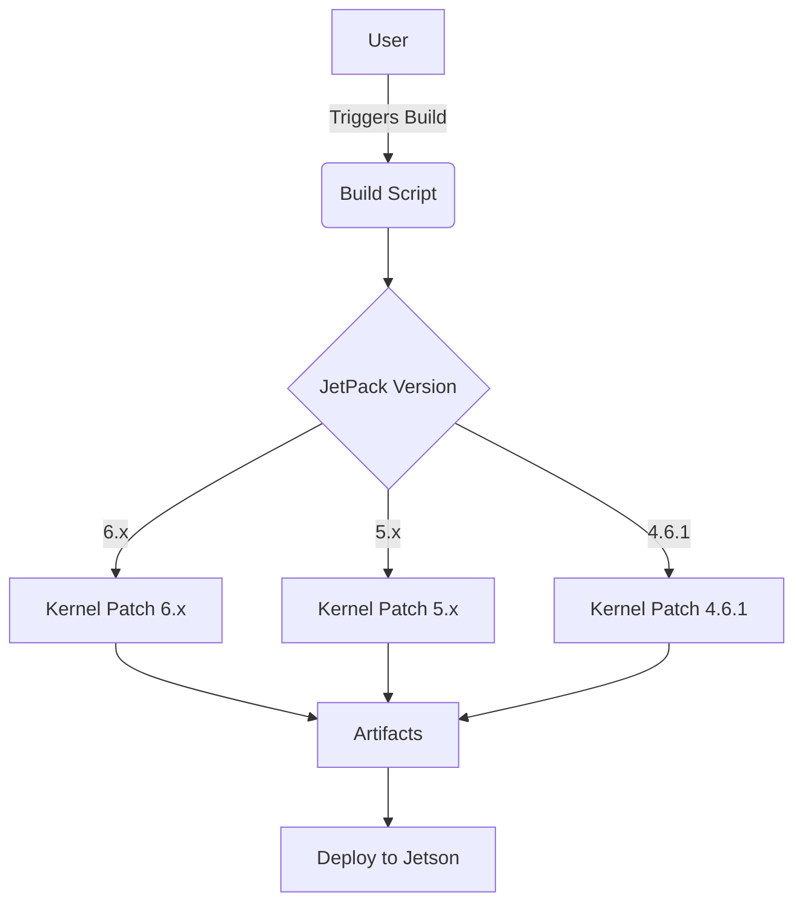
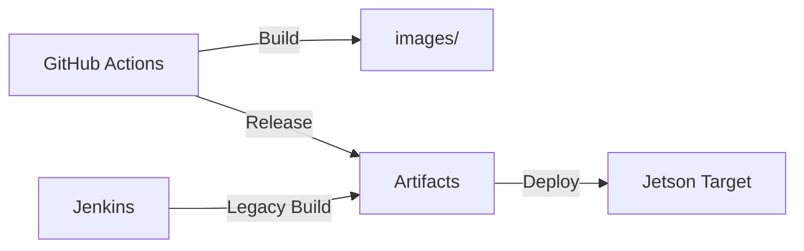
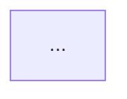

# Copilot Documentation Instructions for realsense_mipi_platform_driver

## Purpose
This guide instructs Copilot and AI agents on how to write and format documentation for this project. All technical docs, architecture diagrams, and workflow explanations should be clear, actionable, and visually structured.

## General Guidelines
- Use concise, direct language. Prefer bullet points and numbered lists for clarity.
- Always reference specific files, scripts, or workflows when describing processes.
- Document real, discoverable patterns and workflows—avoid aspirational or generic advice.
- Use headings and subheadings to organize content.
- For code, commands, or config, use fenced code blocks with language tags (e.g., `sh`, `yaml`, `cpp`).

## Mermaid Syntax for Diagrams
- Use [Mermaid](https://mermaid-js.github.io/mermaid/#/) for all diagrams (architecture, workflows, data flows, CI/CD pipelines).
- Place Mermaid diagrams in fenced code blocks with `mermaid` as the language tag.
- Example architecture diagram:



- Example CI pipeline:


## Document Types
- **Architecture Overview**: Use Mermaid diagrams to show major components and data flows.
- **Build & Test Workflows**: Step-by-step instructions, referencing scripts and YAML files. Use Mermaid for workflow diagrams.
- **Integration Points**: List external dependencies, hardware, and CI/CD connections. Diagram if complex.
- **API/Driver Docs**: Reference relevant files and provide usage examples.

## File Naming & Placement
- Place all documentation in the `doc/` folder.
- Name files descriptively (e.g., `architecture.md`, `ci-pipeline.md`, `integration.md`).
- For diagrams, embed directly in markdown files using Mermaid syntax.

## Example Document Structure

## Required Document Structure & Layout

Every document should follow this structure:

### 1. Introduction
- Briefly describe the purpose, scope, and context of the document.
- State what the reader will learn or achieve.

### 2. High Level Design
- Summarize the major components, architecture, and data flows.
- Use Mermaid diagrams for visualizing system architecture and workflows.
- Reference key directories and files.

### 3. Low Level Design
- Detail specific modules, functions, scripts, or configuration files.
- Include code snippets, configuration examples, and detailed Mermaid diagrams for internal flows.
- Explain integration points, dependencies, and edge cases.

---
## Example Document Structure
```markdown
# Introduction
Describe the document's purpose and scope.

# High Level Design
Summarize architecture and major components.


# Low Level Design
Detail modules, scripts, and internal flows.
```

---
**Feedback Requested:**
If any section is unclear or missing, specify which documentation patterns or diagram types need further guidance.

---
**Feedback Requested:**
If any section is unclear or missing, specify which documentation patterns or diagram types need further guidance.
