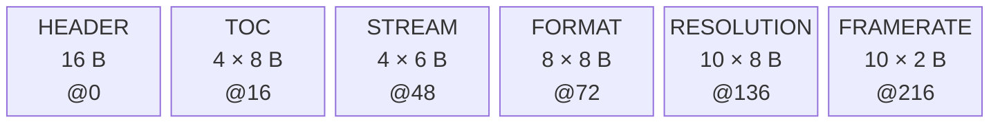
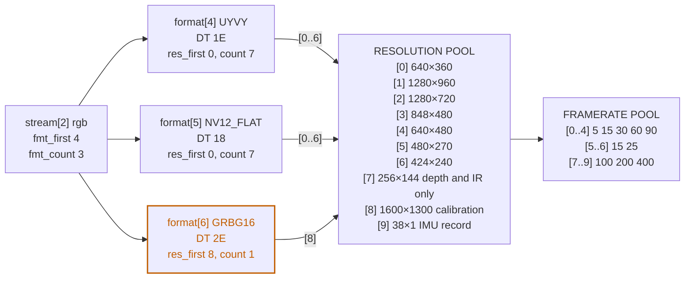

<!-- Source of truth for this design note. Edit it here.

     Figures are Mermaid, rendered inline by GitHub and by VS Code's Markdown preview with
     the Markdown Preview Mermaid Support extension (bierner.markdown-mermaid). No image
     files: edit the diagram text in place.

     Also published on Confluence, which has to be updated by hand after a change:
     https://rsconf.realsenseai.com/display/RealSense/Camera-Resident+Format+Descriptor -->

# Camera-Resident Format Descriptor

Moving the per-SKU format tables out of **d4xx.c** and onto the camera, as a versioned blob
the driver reads over I2C at probe. What the blob has to contain, how it is laid out so
firmware can extend it without breaking older drivers, what it costs on the wire — and the
three pieces of the current tables that **cannot** move.

DESIGN NOTE **format descriptor** · STATUS **implemented — in review** · DRIVER **kernel/realsense/d4xx.c** · TRANSPORT **I2C · 16-bit reg / 8-bit val** · TICKETS **RSDEV-13342 · 13343 · 13344**

## 1 · The starting point: One switch statement, six SKUs

Without a descriptor, the driver falls back to **36 `ds5_format` entries** and **59
`ds5_resolution` entries** spread across fourteen static tables, picked in
`ds5_fixed_configuration()` with a `switch (dev_type)` repeated once per sensor node —
depth, IR, RGB, IMU. Adding a SKU that way means touching all four switches and shipping a
new module.

What that switch is really selecting is a four-level tree, plus a handful of per-entry wire
facts that are not geometry at all:

```text
stream (depth / ir / rgb / imu)
  └─ format          mbus code · source DT · override DT
       └─ resolution width · height
            └─ framerate list
```

Before designing the blob, the fields have to be sorted by *who actually knows the answer*.
This is the decision that shapes everything else:

| Fact | Known by | Consequence |
|---|---|---|
| Supported resolutions and framerates | **CAMERA** | Moves wholesale into the blob. |
| The value that asks the firmware for a format | **CAMERA** | Moves. It is a token in the firmware's own register vocabulary, so only the firmware can state it. |
| The datatype the packets are labelled with | **HOST** | **Stays.** By default it is whatever was requested; where the SerDes cannot carry that, the driver *instructs* a different label. That is a host decision about host hardware. |
| Transport geometry — line padding, packed-pixel and flat-plane scaling | **HOST** | **Stays.** A property of the pixel layout, already carried per format row by the Tegra VI table. |
| Whether embedded metadata is captured | **HOST** | **Stays.** DT `embedded_metadata_height` → `metadata_enabled` → `DS5_*_STREAM_MD`; the camera is told, not asked. |
| `MEDIA_BUS_FMT_*` code | **HOST** | **Stays.** A Linux constant — and one of them, `RS_NV12_FLAT_1X8`, is invented by this repo. |
| Deserializer model, pixel vs tunnel mode, lane budget | **HOST** | **Stays** — but the link mode is *told* to the camera (`0x0404`) before the descriptor is read, so the camera serves the entries valid for it. |
| Whether a Tegra VI format row exists for the layout | **HOST** | **Stays**, in the nvidia-oot patches. |

> [!NOTE]
> The camera must therefore describe formats in **RealSense and CSI-2 terms**, never Linux
> terms. The driver keeps exactly one static table — a `pixfmt_id → mbus_code` map — which
> grows only when a genuinely new pixel layout appears, not once per SKU.

## 2 · Blob layout: Header, table of contents, flat tables

No pointers and no nesting: a fixed header, a table of contents, then flat record arrays
that reference each other by index range. Everything little-endian on the wire — read
host-native by the driver, like every other FW register, since every Jetson is little-endian
— every field explicitly sized, every record stride declared in the TOC.



**Figure 1.** Regions in blob order, with each one's record count, stride and byte
offset; the boxes are equal width rather than to scale. Each TOC entry carries its table's
*stride* as well as its offset and count.
That one field is what lets firmware append fields to a record without breaking a driver
compiled against the older struct.

```c
#define RS_DESC_MAGIC  0x53445352	/* "RSDS" */

struct rs_desc_header {
	u32 magic;
	u16 header_size;	/* stride to the TOC; lets the header itself grow */
	u16 total_size;		/* header + TOC + all tables */
	u8     ver_major;	/* bump = incompatible; driver must fall back  */
	u8     ver_minor;	/* bump = additive only                        */
	u8     n_tables;
	u8     rsvd;
	u32 crc32;		/* over [header_size, total_size) */
} __packed;			/* 16 B */

struct rs_desc_toc {
	u16 type;		/* RS_DESC_T_*                                  */
	u16 entry_size;	/* record stride — may exceed the driver's sizeof() */
	u16 n_entries;
	u16 offset;		/* from start of blob */
} __packed;			/* 8 B */
```

### How forward compatibility actually works

The driver never assumes its own `sizeof()` matches the blob. It copies the overlap and
strides by the declared size:

```c
for (i = 0; i < toc->n_entries; i++) {
	struct rs_desc_format rec = { 0 };

	memcpy(&rec, body + toc->offset + i * toc->entry_size,
	       min_t(size_t, sizeof(rec), toc->entry_size));
	...
}
```

Three rules fall out of that, and they are the whole compatibility contract:

- **New fields go at the end of a record** and bump `ver_minor`. Old drivers stride past
  them; new drivers see zero when reading an old blob, so *zero must always mean "the
  legacy behaviour"*.
- **Unknown TOC types are skipped.** The same transport can later carry the metadata
  layout, the XU/control map, or calibration geometry with no new plumbing.
- **A `ver_major` the driver does not know is a hard fall back** to the built-in tables —
  not a best-effort parse.

## 3 · The records: Four tables and a framerate pool

#### Stream — 6 bytes

```c
struct rs_desc_stream {
	u16 stream_id;	/* the FW's DS5_STREAM_*: depth 0, RGB 1, IMU 2, IR 4 */
	u16 fmt_first;	/* range into FORMAT */
	u16 fmt_count;
} __packed;
```

#### Format — 8 bytes

```c
struct rs_desc_format {
	u16 pixfmt_id;	/* stable RealSense pixel-format enum — NOT a Linux code */
	u8     src_data_type;	/* the token that asks the FW for this format */
	u8     rsvd;		/* padding: keeps every field naturally aligned */
	u16 res_first;	/* range into RESOLUTION */
	u16 res_count;
} __packed;
```

Nothing on the wire is a label. The first record of a range is the default, exactly as in
the driver's own tables, so record order carries it. That a stream is used for calibration
is a host use-case, not an attribute of the stream, so the record does not say so. And the
one entry that depends on the serdes link mode — the D5xx IMU record width — is resolved by
the host writing `DS5_MIPI_SERDES_PIXEL_MODE` before its first read, after which the camera
publishes the table for that mode. The one byte that is not a field is `rsvd`: it keeps
every field of every record naturally aligned, so no build's struct packing is load-bearing
and each record stays 8 bytes. Write it zero, reject it otherwise.

### One datatype byte, and it is a request

`src_data_type` is easy to misread. It is not a claim about what the camera puts on the wire
— it is the value the driver writes to the stream's DT register to *ask* for this format. It
is request language, a token in the firmware's own register vocabulary, which is why only
the camera can state it and why the descriptor carries it at all.

The D401 passthrough entry makes that plain: its byte is `0x2E`, which in that register
means "switch the sensor pipeline to CSI passthrough", not "send RAW10".

> [!NOTE]
> **The request token is also the wire datatype — unless the driver says otherwise.** That is
> the firmware's default, and for six of the ten pixel formats it is the whole story: ask with
> `0x1E` and the packets are labelled `0x1E`.
>
> The other four are a *second* instruction the driver chooses to issue. For flat NV12 the
> exchange reads:
>
> ```text
> DT          0x18   please send NV12
> override DT 0x2A   but label the packets RAW8
> ```
>
> The driver asks for the relabel because it knows its own link cannot carry the first answer:
> the MAX96717 pixel pipe forwards standard 8-bit datatypes and silently drops user-defined
> ones. Leave the override unwritten and the wire datatype would simply be `0x18`.
>
> The other three are the same move for the same kind of reason. The D401 passthrough entry
> requests the mode and instructs RAW8. Depth and the interleaved-IR format are asked for with
> the firmware's own 16-bit tokens, `0x31` for Z16 and `0x32` for R8L8, and both are
> instructed onto YUV422-8 because Tegra VI throttles a user-defined datatype — a driver
> comment recording the resulting frame-rate drop is what put the two tokens in the code to
> begin with.

So the wire label is not something the camera reports. It is a host decision about host
hardware, and on the two formats where it differs from the request it follows the pixel
layout. The host already keeps a table keyed by pixel layout, so it goes there, beside the
media-bus code:

```c
static const struct {
	u16 pixfmt;
	u32 mbus_code;
	u8 wire_dt;	/* 0 = the request token is also the CSI DT */
} ds5_desc_pixfmt_map[] = {
	{ RS_PIXFMT_Z16,        MEDIA_BUS_FMT_UYVY8_1X16,
				GMSL_CSI_DT_YUV422_8 },
	{ RS_PIXFMT_Y8,         MEDIA_BUS_FMT_Y8_1X8 },
	{ RS_PIXFMT_Y8I,        MEDIA_BUS_FMT_VYUY8_1X16,
				GMSL_CSI_DT_YUV422_8 },
	...
	{ RS_PIXFMT_NV12_FLAT,  MEDIA_BUS_FMT_RS_NV12_FLAT_1X8,
				GMSL_CSI_DT_RAW_8 },
	{ RS_PIXFMT_SBGGR10P,   MEDIA_BUS_FMT_RS_SBGGR10P_1X8,
				GMSL_CSI_DT_RAW_8 },
	...
};
```

**The request byte could not key that table.** Being a request vocabulary rather than a wire
vocabulary, it is free to reuse a value: `0x2E` asks for CSI passthrough on a D401 and for
RAW16 calibration on a D5xx, so it would have to mean both "remap to RAW8" and "send as-is".
Keyed by pixel format there is no such clash — every format has one wire datatype everywhere
it appears, on every SKU.

Two more things the record deliberately does *not* carry. Bits per wire pixel follows from
the datatype — RAW8 is 8, RAW16 and YUV422-8 are 16, RGB888 is 24 — so the host derives it
from a standard CSI-2 table rather than trusting a device to restate it consistently. And
transport geometry stays out entirely; see below.

#### Resolution — 8 bytes

```c
struct rs_desc_resolution {
	u16 width, height;	/* V4L2 geometry, written verbatim to DS5_*_RES_WIDTH/HEIGHT */
	u16 fps_first;	/* index into the FRAMERATE pool */
	u16 fps_count;
} __packed;
```

> [!NOTE]
> **Transport geometry is not camera knowledge.** The D401 CSI-PT path is the test case: V4L2
> advertises the true 1288-pixel width, the 1612-byte dword-aligned line is declared by the VI
> format row alone (`frame_x_scale` 5/4 with `frame_x_align` 4), and `ds5_configure()` writes
> `resolution->width` straight through (PR 628). The Y16I doubling lives in the same place, as
> `frame_x_scale` 2/1.
>
> That settles the question generally: line padding and pixel packing are properties of the
> **pixel layout**, not of the camera or the SKU — so they belong in `struct
> tegra_video_format`, keyed by the same mbus code the descriptor's `pixfmt_id` resolves to. A
> descriptor copy would be a second source of truth that VI does not read, so the resolution
> record carries V4L2 geometry and nothing else.

#### Framerate — a flat `u16` pool

No record struct: just an array of frames-per-second values that resolutions point into by
`(first, count)`.

## 4 · Cross-references: Index ranges, not nesting

Ranges rather than nesting is what keeps the blob small. In the current D585 tables,
`d58x_depth_sizes`, `d58x_y8_sizes` and `d58x_rgb_sizes` share their first **seven** entries
verbatim. As a shared pool those are stored once and referenced by three streams; depth and
IR then carry one more, 256×144, which RGB does not offer, so their range is simply one
longer. Framerate lists dedupe even harder, because `{5,15,30,60}` is a *prefix* of
`{5,15,30,60,90}` and can simply be a shorter count into the same run.



**Figure 2.** The D585 RGB node, fully resolved, from the blob the HKR firmware serves.
RGB stops at resolution 6; depth and IR carry one more, the 256×144 entry at 7, which is why
the video run is two ranges rather than one. The 1600×1300 calibration entry and its 15/25
fps run are specific to one branch, and the IMU record (38×1 or 256×1 by link mode) has the
pool's last entry and framerate run to itself.

### Ranges are contiguous — sharing is an optimisation, not a guarantee

A `(first, count)` reference can only name a *run*. Where two streams support overlapping
but not identical sets — the D457 in the next section is exactly this case — the encoder
emits a second run rather than trying to order one pool that satisfies everybody. The parser
stays a bounds-check and a stride; the cost is a few duplicated 8-byte records.

The alternative, an intermediate table of `u16` indices that each format points into, allows
arbitrary sharing. On a D457 it saves about 25 bytes — 112 bytes of records plus 46 of
indices, against 184 bytes of runs. It was rejected: a third indirection is a third thing to
bounds-check on device-supplied data, for a saving three orders of magnitude inside the
aperture.

## 5 · Worked example: A D457, before and after

A D457 reports `DS5_DEVICE_TYPE` = 6 (`D45X`). The four switches in
`ds5_fixed_configuration()` resolve to this:

| Node | Table selected | Formats exposed | Resolutions |
|---|---|---|---|
| depth | `ds5_depth_formats_d43x` | **1 of 3** — `n_formats = 1` | `d43x_depth_sizes` · 8 |
| IR | `ds5_y_formats_45x` | 3 — Y8, Y8I, Y12I calib | `y8_sizes` · 6, plus `d45x_calibration_sizes` · 1 |
| RGB | `ds5_rlt_rgb_format` | 1 — UYVY | `ds5_rlt_rgb_sizes` · 7 |
| IMU | `ds5_imu_formats_extended`<br>or `ds5_imu_formats` | 1 | 38×1, or 32×1 below FW 5.16 |

> [!NOTE]
> **Two things the static tables hide, and the descriptor does not.**
>
> The depth node sets `n_formats = 1` unconditionally, so entries \[1\] Y8 and \[2\]
> calibration of *every* depth table are unreachable through the depth subdev — ten of the
> driver's 36 format entries are dead weight. And the IMU record width is chosen by
> `fw_version >= 0x510`, not by SKU: a firmware-version branch sitting in a SKU switch. Both
> are camera knowledge, and both simply become fields.

### The same camera, as a descriptor

```text
header      magic RSDS   ver 1.0   header_size 16   total_size 334   crc32 ...
toc         STREAM 4×6 @48   FORMAT 6×8 @72   RESOLUTION 23×8 @120   FRAMERATE 15×2 @304

               stream_id   fmt_first   fmt_count
stream[0]              0           0           1    depth
stream[1]              4           1           3    ir
stream[2]              1           4           1    rgb
stream[3]              2           5           1    imu

               pixfmt_id   src_data_type   res_first   res_count
format[0]              1            0x31           0           8    Z16
format[1]              2            0x2a           8           6    Y8
format[2]              3            0x32           8           6    Y8I
format[3]              4            0x24          14           1    Y12I
format[4]              6            0x1e          15           7    UYVY
format[5]             10            0x2a          22           1    IMU

               width   height   fps_first   fps_count    pool values
                                                         used by format[0] Z16
res[0]          1280      720           0           3    5 15 30
res[1]           848      480           0           5    5 15 30 60 90
res[2]           848      100          12           1    100
res[3]           640      480           0           5
res[4]           640      360           0           5
res[5]           480      270           0           5
res[6]           424      240           0           5
res[7]           256      144           4           1    90
                                                         used by format[1] Y8, format[2] Y8I
res[8]          1280      720           0           3
res[9]           848      480           0           5
res[10]          640      480           0           5
res[11]          640      360           0           5
res[12]          480      270           0           5
res[13]          424      240           0           5
                                                         used by format[3] Y12I
res[14]         1280      800           9           2    15 25
                                                         used by format[4] UYVY
res[15]         1280      800           5           4    5 10 15 30
res[16]         1280      720           5           4
res[17]          848      480           0           4    5 15 30 60
res[18]          640      480           0           4
res[19]          640      360           0           5
res[20]          480      270           0           5
res[21]          424      240           0           5
                                                         used by format[5] IMU
res[22]           38        1          11           4    50 100 200 400

               flat u16 pool, indexed by fps_first
framerate   [0] 5 15 30 60 90   [5] 5 10 15 30   [9] 15 25   [11] 50 100 200 400
```

Each column above is one field of the record, so a cross-reference reads off two of them:
`format[1]` has `res_first = 8` and `res_count = 6`, naming `res[8]` through `res[13]`. No
format on this SKU is remapped on the wire, so every datatype here is a request token; two
of them, depth and the interleaved-IR format, are relabelled YUV422-8 on the wire by the
host registry. Every width in the table is written straight to the firmware register — a
D457 has no divergence between what V4L2 advertises and what the firmware is told.

The highlighted framerate runs show the packing an encoder can do for free: the depth
5/15/30 run is a prefix of 5/15/30/60/90, the lone 90 is its suffix, and the isolated 100
fps of the 848×100 mode is the second element of the IMU run at index 12. Fifteen values
cover eight distinct framerate lists.

Whether embedded metadata is captured is the host's decision — DT `embedded_metadata_height`
per `cam-type` node, written to `DS5_*_STREAM_MD` at stream start — so the camera is told,
not asked, and the descriptor carries nothing about it.

### Where the sharing stops

The resolution table holds 23 records where only 14 are distinct. The IR run at `res[8]`
through `res[13]` repeats six of the depth entries verbatim, because IR omits 848×100 and
256×144 from the middle of the depth run and a range cannot skip. The RGB run repeats three
more, for the same reason. That is 72 bytes of deliberate duplication, traded for a parser
that is a bounds-check and a stride.

The D585 in section 4 shares far better only because its three video tables agree for their
first seven entries. Even there the sharing is partial: 256×144 is depth and IR only. The
D457 is the ordinary case, and it is the one that sets the design: **plan for duplication,
not for a perfectly packed pool.**

| Table | Entries | Stride | Bytes | Offset |
|---|---|---|---|---|
| Header | — | — | 16 | 0 |
| TOC | 4 | 8 | 32 | 16 |
| Stream | 4 | 6 | 24 | 48 |
| Format | 6 | 8 | 48 | 72 |
| Resolution | 23 | 8 | 184 | 120 |
| Framerate | 15 | 2 | 30 | 304 |
| **Total** |  |  | **334** | **two 256-byte reads** |

## 6 · Worked example, with an override: A D585, before and after

A D585 reports `DS5_DEVICE_TYPE` = 9 (`D58X`). Its static tables are the ones with a
wire-datatype override and a link-mode branch, so this is the example that exercises the two
format bytes and the `0x0404` write:

| Node | Table selected | Formats exposed | Resolutions |
|---|---|---|---|
| depth | `ds5_depth_formats_d58x` | **1 of 2** — `n_formats = 1` | `d58x_depth_sizes` · 7 |
| IR | `ds5_y_formats_d58x` | 3 — Y8, Y8I, Y16I calib | `d58x_y8_sizes` · 7, plus `d58x_calibration_sizes` · 1 |
| RGB | `ds5_rgb_formats_d58x` | 3 — UYVY, NV12 flat *(override)*, GRBG16 calib | `d58x_rgb_sizes` · 7, plus `d58x_calibration_sizes` · 1 |
| IMU | `d58x_imu_formats_extended_tunnel_mode`<br>or `ds5_imu_formats_extended_d58x_pixel_mode` | 1 | 38×1, or 256×1 when `d58x_pixel_mode` |

> [!NOTE]
> **Three things this SKU shows that the D457 does not.**
>
> The depth, IR and RGB size tables agree for seven entries, so most of the video geometry
> collapses to one run that three streams reference; depth and IR extend it by one for
> 256×144. The IMU branch on `d58x_pixel_mode` is
> a host decision, so it does not appear in the blob at all: the host writes
> `DS5_MIPI_SERDES_PIXEL_MODE` and the camera publishes one of two blobs that differ in a
> single width. And NV12 is the one record on any SKU where the two datatype bytes differ.

### The same camera, as a descriptor

```text
header      magic RSDS   ver 1.0   header_size 16   total_size 236   crc32 ...
toc         STREAM 4×6 @48   FORMAT 8×8 @72   RESOLUTION 10×8 @136   FRAMERATE 10×2 @216

               stream_id   fmt_first   fmt_count
stream[0]              0           0           1    depth
stream[1]              4           1           3    ir
stream[2]              1           4           3    rgb
stream[3]              2           7           1    imu

               pixfmt_id   src_data_type   res_first   res_count
format[0]              1            0x31           0           8    Z16
format[1]              2            0x2a           0           8    Y8
format[2]              3            0x32           0           8    Y8I
format[3]              5            0x2e           8           1    Y16I
format[4]              6            0x1e           0           7    UYVY
format[5]              7            0x18           0           7    NV12_FLAT
format[6]              8            0x2e           8           1    GRBG16
format[7]             10            0x2a           9           1    IMU

               width   height   fps_first   fps_count    pool values
                                                         used by format[0] [1] [2] [4] [5]
res[0]           640      360           0           5    5 15 30 60 90
res[1]          1280      960           0           4    5 15 30 60
res[2]          1280      720           0           4
res[3]           848      480           0           4
res[4]           640      480           0           5
res[5]           480      270           0           5
res[6]           424      240           0           5
                                                         used by format[0] [1] [2]
res[7]           256      144           0           5
                                                         used by format[3] Y16I, format[6] GRBG16
res[8]          1600     1300           5           2    15 25
                                                         used by format[7] IMU
res[9]            38        1           7           3    100 200 400   (256×1 in the pixel-mode blob)

               flat u16 pool, indexed by fps_first
framerate   [0] 5 15 30 60 90   [5] 15 25   [7] 100 200 400
```

Ten resolution records where the D457 needed 23. The video run is two ranges rather than one
only because 256×144 is offered on depth and IR but not RGB; everything else is shared. The
pixel-mode blob is this one byte-for-byte except `res[9].width` and
the CRC.

### What the driver does with the NV12 record

The blob says `18`, so the driver writes `18` to the stream's `DS5_*_STREAM_DT` register:
that is how you ask a D585 for flat NV12. On its own that would put YUV420-8 on the wire.
The registry in section 3 says NV12 must be labelled RAW8, so the parser puts `0x2A` in the
format's `override_data_type` and `ds5_wire_data_type()` then hands it to every place the
label matters — the firmware's DT-override register, the serializer and deserializer pipe
routing, and the VI channel's datatype match. Those four writes have to agree, which is the
point of resolving the label in one place.

Three more formats on this SKU are relabelled the same way: depth and the interleaved-IR
format onto YUV422-8, for the Tegra VI reason above. For the remaining four the registry
says nothing, no override is written, and the firmware's default applies: the packets carry
the datatype that was requested.

What the RAW8 lines *mean* — three half-rows of chroma per two rows of luma — is the pixel
layout's business and lives in the `RS_NV12_FLAT_1X8` VI format row (`frame_y_scale` 3/2),
which is exactly the geometry section 3 keeps out of the blob.

Byte accounting for this blob is in section 7.

## 7 · Cost: 236 bytes for a D585

As generated by the HKR firmware, identical in size for either link mode:

| Table | Entries | Stride | Bytes | Contents |
|---|---|---|---|---|
| Header | — | — | 16 | magic, sizes, version, CRC32 |
| TOC | 4 | 8 | 32 | stream, format, resolution, framerate |
| Stream | 4 | 6 | 24 | depth, IR, RGB, IMU |
| Format | 8 | 8 | 64 | 1 depth, 3 IR, 3 RGB, 1 IMU |
| Resolution | 10 | 8 | 80 | 7 shared video + 1 depth/IR only + 1 calibration + 1 IMU record |
| Framerate | 10 | 2 | 20 | 5/15/30/60/90 + 15/25 + 100/200/400 |
| **Total** |  |  | **236** | **one 256-byte read** |

The D457 above is 334 bytes on the same encoding. Across the RS400 firmware the tables run
from 248 bytes (D40x) to 364 (D41x, the SKU with the most IR and RGB formats). All of them
fit inside the existing `DS5_HWMC_BUFFER_SIZE` of 1024, which usefully bounds the whole
design: **a 2 KB aperture is enough, and a single descriptor never needs paging.**

## 8 · Transport: A stateless aperture beats a windowed read

`ds5_raw_read()` already does arbitrary-length `regmap_raw_read` against a 16-bit-address,
8-bit-value map, so the blob only needs somewhere to live. Three candidates:

| Option | Stateful? | Verdict |
|---|---|---|
| **Linear aperture.** 2 KB of read-only register space at a fixed base. | No | **CHOSEN** Chunked reads at any offset, in any order, from any caller. |
| **Offset register + window.** Write a chunk index, read a fixed window. | Yes | **AVOID** Four subdevs probe the same physical camera concurrently; a shared cursor is a race for no benefit. |
| **HWMC `GET_DESCRIPTOR`.** Response through the 1 KB HWMC buffer. | Yes | **FALLBACK** Same race, plus HWMC latency. Use only if no contiguous aperture is available. |

```c
/* two 2-byte probes: legacy FW loads one word for an unmapped register
 * and its I2C slave wedges if the master clocks past it.
 * Returns 0 / -ENODEV (no descriptor) / an I2C errno, so a transient
 * read failure can be retried instead of latching the static tables. */
ret = ds5_desc_check_magic(state);
if (ret < 0)
	return ret;
ds5_raw_read(state, RS_DESC_BASE, &header, sizeof(header));
/* validate: ver_major, header_size, total_size <= RS_DESC_MAX */

for (off = 0; off < total; off += chunk)
	ds5_raw_read(state, RS_DESC_BASE + off, buf + off, chunk);

/* verify crc32; on mismatch, warn and fall back to the static tables */
```

> [!WARNING]
> **Never clock more bytes than the firmware loaded.** A bare 16-byte header read at the
> aperture killed a legacy-FW camera on the rig: firmware without the aperture loads a single
> 16-bit word for an unmapped register, and the DesignWare I2C slave wedges — unreachable
> until power-cycle — when the master reads past it. Short reads are harmless (the driver
> polls the 4-byte HWMC status with 2-byte reads on every command). So the probe is two 2-byte
> reads of the magic, and only firmware that answered `RSDS` ever sees a longer read; every
> later read is bounded by `total_size`.

Keep `chunk` at 256 bytes. The existing HWMC path proves 1 KB transfers work, but a smaller
chunk keeps each transaction well inside what the Tegra I2C adapter and the GMSL tunnel
handle comfortably, and makes a partial failure cheap to retry.

## 9 · Driver lifecycle: Fetch once per camera, and know when it goes stale

- **Once per camera, not per subdev.** `ds5_desc_apply()` runs in
  `ds5_fixed_configuration()`, right after the link mode is written to
  `DS5_MIPI_SERDES_PIXEL_MODE` and before any sensor's format table is chosen. The first
  subdev to get there fetches and parses under the `ds5_dev` lock; the other three find
  the result and only point their `sensor->formats` at it.
- **Gated by the existing readiness check.** It runs after `ds5_wait_device_type()` has
  succeeded — a device in DFU recovery serves no descriptor, and the recovery path
  short-circuits ahead of it.
- **Parsed tables live for the module's lifetime**, on a module-wide list freed at
  `module_exit`, never on slot re-init: a sibling subdev can outlive the primary that owns
  the `ds5_dev` slot (sysfs unbind) while its `sensor->formats` still points into them.
  The field was already `const struct ds5_format *`, so nothing downstream changed.
- **After a HW reset the descriptor is re-probed, not re-applied.** `ds5_desc_recheck()`
  runs once `ds5_hw_init()` has re-written the link mode, and compares the header CRC with
  the tables in use. A changed or newly present descriptor is logged with "reload d4xx to
  apply"; formats are never swapped underneath registered V4L2 nodes (see section 12).
- **Never on the stream-start path.** Probe only.

> [!NOTE]
> **Firmware side.** The RS400 firmware serves the blob at `REG_BASE_MIPI_FORMAT_DESC` =
> `0x6000` (2 KB) from `AppServicesLib/MipiFormatDesc.c`, one const table per D4xx product
> type (D40x 248 B, D43x 314 B, D45x 334 B, D41x 364 B), published just before
> `REG_PRODUCT_TYPE` becomes valid. Product types without a table keep answering the legacy
> 2-byte dummy, so the driver's magic check fails cleanly there.
>
> The D585 (HKR) firmware serves the same aperture from
> `io/gmsl/hwlib/src/gmsl_format_desc.c`: one 236-byte blob per serdes link mode for device
> type 9 — identical except for the IMU record (38×1 tunnel, 256×1 pixel) — republished
> whenever the host writes `0x0404`. Its I2C HAL pads over-reads with `0xFF`, so a D585
> without the feature also fails the magic probe cleanly.

> [!WARNING]
> **Validate the blob like untrusted input.** Every `(first, count)` pair is an
> attacker-shaped index into another table, arriving from a device over I2C and feeding a
> `kcalloc` size. Bounds-check each range against the target table's `n_entries` *before* use,
> cap `total_size` at the aperture size, and require every one of the four streams to be
> present.
>
> Any failure — bad magic, CRC mismatch, unknown `ver_major`, out-of-range index, unknown
> stream id, zero framerate — is reported with a `dev_warn` naming the reason, and the driver
> falls back to the built-in tables. There is no partial acceptance; the only tolerated oddity
> is an unknown `pixfmt_id`, which is skipped so a newer camera can advertise a layout an
> older driver has no mbus code for. A camera that answers the magic probe with anything but
> `RSDS` gets a single "format descriptors not provided by camera" line.

## 10 · Limits: What stays in the driver regardless

Worth stating plainly, because it bounds the payoff.

### Host context is told, not filtered

The D585 IMU record is 38 bytes behind a tunnel-mode serdes and 256 behind a pixel-mode one,
and only the host knows which it has (`state->dser_ops == &max96712_interface`). Rather than
advertising both and letting the driver filter, the driver writes
`DS5_MIPI_SERDES_PIXEL_MODE` at the point where it decides the mode, immediately before its
first descriptor read, and the firmware publishes the blob for that mode. Lane count and
deserializer model stay host decisions in exactly the same way — configured into the camera,
never inferred by it.

### The nvidia-oot side does not move at all

A camera-advertised format with no matching `tegra_video_format` row — and, for the
calibration and NV12 layouts, no `TEGRA_VIDEO_FORMAT_OVERRIDE` row — is simply unusable. The
descriptor removes churn from `d4xx.c`; it removes none from the `0001` and `0013` format
patches, which still need a kernel patch per new pixel layout across every JetPack carrier.

### Legacy firmware keeps the static tables alive

Every shipping D4xx SKU predates the descriptor, so the static tables stay behind the
fallback indefinitely. The honest short-term accounting is that this adds code rather than
removing it. The payoff arrives as the D5xx family adds SKUs — which is the bet this design
makes.

## 11 · Status: Three repositories, one wire format

| Side | Where | State |
|---|---|---|
| Driver | `kernel/realsense/d4xx.c` — `ds5_desc_*`, RSDEV-13342 | Parser, fallback and post-reset recheck implemented; compiles clean on JP6.2 and passes checkpatch. Accepted the D457 blob on a rig after the RS400 firmware update. |
| RS400 firmware | `AppServicesLib/MipiFormatDesc.{h,c}`, RSDEV-13343 | One const blob per D4xx product type at `0x6000`; parser and gated test in `fw_tests`. |
| HKR (D585) firmware | `io/gmsl/hwlib/src/gmsl_format_desc.c`, RSDEV-13344, PR 617 | Two const blobs, one per link mode, republished on the `0x0404` write; host unit tests in `io/gmsl/tests`. |
| Cross-check | `fw_tests/tools/mipi_desc_xcheck.py` | Decodes each generated blob and compares it, stream by stream, with the driver's static tables: all six blobs identical. |

Still open: streaming a D585 on a rig with the new HKR build, so the descriptor path is
exercised end to end for both link modes rather than only against the host tests.

## 12 · Follow-up: Re-request the descriptor after a HW reset

Today the descriptor is fetched once, at probe. After a HW reset — and after a DFU, which is
the case where the descriptor can legitimately change — `ds5_desc_recheck()` only compares
the header CRC and asks for a module reload. The formats a camera advertises are therefore
those of the firmware it booted with, until `d4xx` is reloaded.

Re-reading and re-applying the blob in the driver is the easy half. The hard half is that
the formats are already *published*: the Tegra VI channel builds its format bitmap from the
subdev's mbus codes once, when the video node is registered, so a refreshed
`sensor->formats` is not seen by user space until the node is re-created. A V4L2 patch that
allowed the published format list to be refreshed in place was written for this driver in
the past and abandoned; this follow-up is what would justify reviving it.

- Driver side: reload the blob in the recovery path (after `ds5_hw_init()` has re-written
  the link mode), and swap `sensor->formats` only while no stream is active — the
  module-lifetime table list already makes the old tables safe to keep.
- Kernel side: revive the VI/V4L2 refresh patch across every JetPack carrier, since one
  `d4xx.c` builds against all of them.

---

*Design note · byte counts are the blobs generated by the RS400 and HKR firmware,
cross-checked against kernel/realsense/d4xx.c by fw_tests/tools/mipi_desc_xcheck.py*
