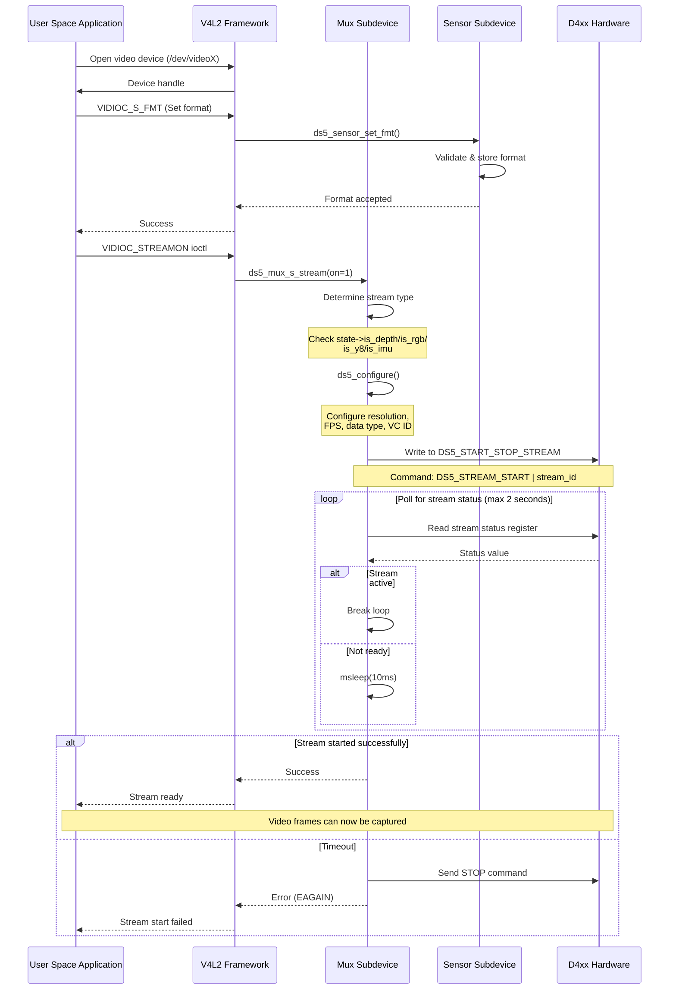

# Stream Start Flow in D4xx Driver

## Table of Contents
1. [Introduction](#introduction)
2. [High Level Design](#high-level-design)
3. [Low Level Design](#low-level-design)
4. [Integration Points](#integration-points)
5. [Error Handling](#error-handling)
6. [References](#references)

---

## Introduction

This document describes the complete flow for starting a video stream in the RealSense D4xx driver (`kernel/realsense/d4xx.c`). Understanding this flow is essential for:

- **Debugging**: Identifying and resolving issues in the stream initialization process
- **Extension**: Adding new features or stream types to the driver
- **Maintenance**: Understanding the driver architecture for ongoing support
- **Integration**: Properly integrating the driver with other kernel components and user-space applications

The D4xx driver supports multiple stream types:
- **Depth stream**: Z16 format depth data
- **RGB stream**: Color video stream (YUYV/UYVY)
- **IR stream**: Infrared stream (Y8/Y8I)
- **IMU stream**: Inertial Measurement Unit data

The stream start flow handles the initialization, configuration, and activation of these streams through the V4L2 (Video for Linux 2) subsystem.

---

## High Level Design

The stream start process follows a layered architecture, with user-space applications communicating through V4L2 APIs, which then invoke the driver's stream operations.

### Stream Start Sequence



### Major Components

1. **V4L2 Framework**: Linux kernel subsystem for video devices
2. **Mux Subdevice**: Multiplexer that routes between different sensor streams
3. **Sensor Subdevices**: Individual subdevices for depth, RGB, IR, and IMU streams
4. **Hardware Interface**: I2C-based communication with D4xx hardware
5. **Configuration Registers**: Hardware registers for stream configuration

---

## Low Level Design

### Key Data Structures

#### Stream State Management

```c
struct ds5_sensor {
    struct v4l2_subdev sd;          // V4L2 subdevice
    struct media_pad pad;           // Media pad for graph
    struct v4l2_mbus_framefmt format; // Current format
    u16 mux_pad;                    // Pad ID in mux
    struct {
        const struct ds5_format *format;
        const struct ds5_resolution *resolution;
        u16 framerate;
    } config;                        // Active configuration
    bool streaming;                  // Streaming state
    const struct ds5_format *formats; // Supported formats
    unsigned int n_formats;          // Number of formats
    int pipe_id;                     // SERDES pipe ID
};

struct ds5 {
    struct { struct ds5_sensor sensor; } depth;
    struct { struct ds5_sensor sensor; } ir;
    struct { struct ds5_sensor sensor; } rgb;
    struct { struct ds5_sensor sensor; } imu;
    struct {
        struct ds5_mux_subdev sd;
        struct media_pad pads[DS5_MUX_PAD_COUNT];
        struct ds5_sensor *last_set;
    } mux;
    // ... other fields
};
```

### Key Functions

#### 1. Stream Start Entry Point: `ds5_mux_s_stream()`

**Location**: `kernel/realsense/d4xx.c:4342`

**Purpose**: Main entry point for starting/stopping streams, called by V4L2 framework.

**Flow**:
```
ds5_mux_s_stream(struct v4l2_subdev *sd, int on)
│
├─> Check if already in requested state (avoid duplicate calls)
│
├─> Determine stream type (DEPTH/RGB/IR/IMU)
│   └─> Set appropriate registers:
│       • config_status_base (e.g., DS5_DEPTH_CONFIG_STATUS)
│       • stream_status_base (e.g., DS5_DEPTH_STREAM_STATUS)
│       • stream_id (e.g., DS5_STREAM_DEPTH)
│       • vc_id (Virtual Channel ID: 0-3)
│
├─> If starting (on == 1):
│   │
│   ├─> [SERDES only] Allocate pipeline
│   │   └─> max9296_get_available_pipe_id()
│   │
│   ├─> Configure stream parameters
│   │   └─> ds5_configure()
│   │
│   ├─> Write START command to hardware
│   │   └─> ds5_write(DS5_START_STOP_STREAM, DS5_STREAM_START | stream_id)
│   │
│   └─> Poll for stream status (timeout: 2 seconds)
│       └─> Loop: Read stream_status_base & config_status_base
│           • Check: (status & DS5_STATUS_STREAMING) && streaming == DS5_STREAM_STREAMING
│           • Poll interval: 10ms (DS5_START_POLL_TIME)
│           • Max iterations: 200 (DS5_START_MAX_COUNT)
│
└─> If stopping (on == 0):
    │
    ├─> Write STOP command to hardware
    │   └─> ds5_write(DS5_START_STOP_STREAM, DS5_STREAM_STOP | stream_id)
    │
    └─> [SERDES only] Release pipeline
        └─> max9296_release_pipe()
```

**Key Registers**:
- `DS5_START_STOP_STREAM` (0x1000): Stream control register
- `DS5_DEPTH_STREAM_STATUS` (0x1004): Depth stream status
- `DS5_RGB_STREAM_STATUS` (0x1008): RGB stream status
- `DS5_IR_STREAM_STATUS` (0x1014): IR stream status
- `DS5_IMU_STREAM_STATUS` (0x100C): IMU stream status

**Stream Control Values**:
- `DS5_STREAM_START` (0x200): Start stream command
- `DS5_STREAM_STOP` (0x100): Stop stream command
- `DS5_STREAM_DEPTH` (0x0): Depth stream ID
- `DS5_STREAM_RGB` (0x1): RGB stream ID
- `DS5_STREAM_IR` (0x4): IR stream ID
- `DS5_STREAM_IMU` (0x2): IMU stream ID

**Status Values**:
- `DS5_STREAM_IDLE` (0x1): Stream is idle
- `DS5_STREAM_STREAMING` (0x2): Stream is active
- `DS5_STATUS_STREAMING` (0x1): Configuration streaming bit

#### 2. Stream Configuration: `ds5_configure()`

**Location**: `kernel/realsense/d4xx.c:1659`

**Purpose**: Configure hardware registers with stream parameters before starting.

**Configuration Steps**:

```
ds5_configure(struct ds5 *state)
│
├─> Determine stream type and set register addresses
│   ├─> DEPTH:  dt_addr=DS5_DEPTH_STREAM_DT, width_addr=DS5_DEPTH_RES_WIDTH, etc.
│   ├─> RGB:    dt_addr=DS5_RGB_STREAM_DT, width_addr=DS5_RGB_RES_WIDTH, etc.
│   ├─> IR:     dt_addr=DS5_IR_STREAM_DT, width_addr=DS5_IR_RES_WIDTH, etc.
│   └─> IMU:    dt_addr=DS5_IMU_STREAM_DT, width_addr=DS5_IMU_RES_WIDTH, etc.
│
├─> [SERDES only] Setup pipeline
│   └─> ds5_setup_pipeline(data_type1, data_type2, pipe_id, vc_id)
│
├─> Write data type to hardware
│   • For DEPTH Z16: Write 0x31 (custom data type)
│   • For IR Y8I: Write 0x32 (custom data type)
│   • For others: Write configured data_type
│   └─> ds5_write(dt_addr, data_type)
│
├─> Write metadata configuration
│   └─> ds5_write(md_addr, (vc_id << 8) | md_fmt)
│
└─> If streaming enabled:
    ├─> Write override register (if applicable)
    ├─> Write framerate
    │   └─> ds5_write(fps_addr, sensor->config.framerate)
    ├─> Write resolution width
    │   └─> ds5_write(width_addr, sensor->config.resolution->width)
    └─> Write resolution height
        └─> ds5_write(height_addr, sensor->config.resolution->height)
```

**Stream-Specific Registers**:

| Stream | Data Type Reg | Metadata Reg | FPS Reg | Width Reg | Height Reg | Override Reg |
|--------|--------------|--------------|---------|-----------|------------|--------------|
| Depth  | 0x4000 | 0x4002 | 0x400C | 0x4004 | 0x4008 | 0x401C |
| RGB    | 0x4020 | 0x4022 | 0x402C | 0x4024 | 0x4028 | N/A |
| IR     | 0x4080 | 0x4082 | 0x408C | 0x4084 | 0x4088 | 0x409C |
| IMU    | 0x4040 | 0x4042 | 0x404C | 0x4044 | 0x4048 | N/A |

**Data Types**:
- `GMSL_CSI_DT_YUV422_8` (0x1E): YUV 4:2:2 8-bit
- `GMSL_CSI_DT_RGB_888` (0x24): RGB 24-bit
- `GMSL_CSI_DT_RAW_8` (0x2A): RAW 8-bit
- `GMSL_CSI_DT_EMBED` (0x12): Embedded data (metadata)

#### 3. Sensor Subdevice Stream Control: `ds5_sensor_s_stream()`

**Location**: `kernel/realsense/d4xx.c:1820`

**Purpose**: Update sensor subdevice streaming state (simpler than mux).

**Flow**:
```c
static int ds5_sensor_s_stream(struct v4l2_subdev *sd, int on)
{
    struct ds5_sensor *sensor = container_of(sd, struct ds5_sensor, sd);
    
    // Simply update streaming flag
    sensor->streaming = on;
    
    return 0;
}
```

This function is called on individual sensor subdevices and primarily updates the streaming state flag. The actual hardware interaction happens at the mux level.

#### 4. I2C Communication Functions

**Register Write**: `ds5_write()`
```c
static int ds5_write(struct ds5 *state, u16 reg, u16 val)
{
    u8 value[2];
    value[1] = val >> 8;    // MSB
    value[0] = val & 0xFF;  // LSB
    
    return regmap_raw_write(state->regmap, reg, value, sizeof(value));
}
```

**Register Read**: `ds5_read()`
```c
static int ds5_read(struct ds5 *state, u16 reg, u16 *val)
{
    return regmap_raw_read(state->regmap, reg, val, 2);
}
```

### Timing Constants

```c
#define DS5_START_POLL_TIME    10      // Poll interval: 10ms
#define DS5_START_MAX_TIME     2000    // Max wait time: 2 seconds
#define DS5_START_MAX_COUNT    (DS5_START_MAX_TIME / DS5_START_POLL_TIME)  // 200 iterations
```

### Stream Type Detection

The driver determines the stream type using flags in the `ds5` state structure:

```c
if (state->is_depth) {
    // Handle depth stream
} else if (state->is_rgb) {
    // Handle RGB stream
} else if (state->is_y8) {
    // Handle IR stream
} else if (state->is_imu) {
    // Handle IMU stream
}
```

These flags are set during device probing based on device tree configuration or platform data.

---

## Integration Points

### Device Tree Integration

The driver is typically instantiated through device tree entries that specify:
- I2C bus and address
- Camera type (Depth, RGB, Y8, IMU)
- Virtual channel assignments
- SERDES configuration (for GMSL interface)

Example device tree snippet:
```dts
i2c@... {
    d4xx@1a {
        compatible = "intel,d4xx";
        reg = <0x1a>;
        cam-type = "Depth";  // or "RGB", "Y8", "IMU"
        // Additional properties...
    };
};
```

### V4L2 API Integration

User-space applications interact with the driver through standard V4L2 ioctls:

1. **Device Enumeration**:
   - `/dev/video0` - Depth stream
   - `/dev/video1` - Depth metadata
   - `/dev/video2` - RGB stream
   - `/dev/video3` - RGB metadata
   - `/dev/video4` - IR stream
   - `/dev/video5` - IMU stream

2. **Key IOCTLs**:
   - `VIDIOC_QUERYCAP`: Query device capabilities
   - `VIDIOC_ENUM_FMT`: Enumerate supported formats
   - `VIDIOC_G_FMT` / `VIDIOC_S_FMT`: Get/set format
   - `VIDIOC_G_PARM` / `VIDIOC_S_PARM`: Get/set parameters (framerate)
   - `VIDIOC_STREAMON`: Start streaming (triggers `ds5_mux_s_stream(on=1)`)
   - `VIDIOC_STREAMOFF`: Stop streaming (triggers `ds5_mux_s_stream(on=0)`)

### Kernel Module Dependencies

The driver depends on several kernel subsystems:

1. **V4L2 Subsystem**: Core video device framework
   - `v4l2-subdev.h`: Subdevice API
   - `v4l2-device.h`: Device API
   - `media-entity.h`: Media controller framework

2. **I2C Subsystem**: Hardware communication
   - `i2c.h`: I2C client/adapter API
   - `regmap.h`: Register map abstraction

3. **SERDES Support** (conditional):
   - `max9295.h` / `max9296.h`: GMSL serializer/deserializer
   - Provides high-bandwidth connection for multiple cameras

4. **Platform-Specific**:
   - Tegra Camera Platform (NVIDIA Jetson)
   - Intel IPU6 (Intel platforms)

### Hardware Bring-up Sequence

During system initialization:

```
Boot
 │
 ├─> Kernel loads i2c-tegra / i2c-designware driver
 │   └─> I2C bus becomes available
 │
 ├─> Kernel loads d4xx driver module
 │   └─> ds5_probe() called for each device tree entry
 │       │
 │       ├─> Initialize regmap for I2C communication
 │       ├─> Verify communication with hardware (read FW version)
 │       ├─> Configure SERDES (if applicable)
 │       ├─> Initialize sensor subdevices (depth, RGB, IR, IMU)
 │       ├─> Initialize mux subdevice
 │       ├─> Register with V4L2 subsystem
 │       └─> Create DFU character device for firmware updates
 │
 └─> User-space can now access /dev/videoX devices
```

### Media Controller Graph

The driver registers a media controller graph showing the relationship between entities:

```
[D4xx Mux Subdevice]
    ├─ Pad 0 (SOURCE) -> Connected to VI (Video Input) or CSI receiver
    ├─ Pad 1 (SINK)   <- Depth sensor subdevice
    ├─ Pad 2 (SINK)   <- RGB sensor subdevice
    ├─ Pad 3 (SINK)   <- IR sensor subdevice
    └─ Pad 4 (SINK)   <- IMU sensor subdevice
```

View with: `media-ctl -p`

---

## Error Handling

### Stream Start Timeout

**Symptom**: Stream fails to start, timeout after 2 seconds

**Possible Causes**:
1. **Hardware not responding**: I2C communication issue
2. **Invalid configuration**: Unsupported resolution/framerate combination
3. **Firmware issue**: Camera firmware in error state
4. **SERDES pipeline**: No available pipes (GMSL only)

**Error Path**:
```c
if (DS5_START_MAX_COUNT == i) {
    dev_err(&state->client->dev,
        "start streaming failed, exit on timeout\n");
    
    // Notify firmware to stop
    ds5_write(state, DS5_START_STOP_STREAM,
        DS5_STREAM_STOP | stream_id);
    
    ret = -EAGAIN;
    goto restore_s_state;
}
```

**Recovery**:
- Check `dmesg` for error messages
- Verify I2C communication: `i2cdetect -y <bus>`
- Check configuration status register
- Attempt firmware recovery via DFU device

### Configuration Status Errors

The driver reads the configuration status register to check for errors:

```c
ds5_read(state, config_status_base, &status);
```

**Status Bits**:
- `DS5_STATUS_STREAMING` (0x1): Stream is active
- `DS5_STATUS_INVALID_DT` (0x2): Invalid data type
- `DS5_STATUS_INVALID_RES` (0x4): Invalid resolution
- `DS5_STATUS_INVALID_FPS` (0x8): Invalid framerate

### I2C Communication Errors

All I2C operations check for errors:

```c
ret = ds5_write(state, reg, val);
if (ret < 0) {
    dev_err(&state->client->dev, "I2C write failed: %d\n", ret);
    return ret;
}
```

**Common I2C Errors**:
- `-EREMOTEIO` (-121): I2C transaction failed
- `-ETIMEDOUT` (-110): I2C timeout
- `-ENODEV` (-19): Device not found

### Edge Cases

1. **Duplicate Stream Start**:
   - Handled by checking `sensor->streaming == on` at function entry
   - Avoids redundant hardware commands

2. **Stream Type Mismatch**:
   - Validated during format setting
   - Only supported formats are accepted

3. **SERDES Pipeline Exhaustion**:
   ```c
   sensor->pipe_id = max9296_get_available_pipe_id(...);
   if (sensor->pipe_id < 0) {
       dev_err(&state->client->dev, "No free pipe in max9296\n");
       ret = -ENOSR;
       goto restore_s_state;
   }
   ```

4. **State Restoration on Error**:
   ```c
   restore_s_state:
       sensor->streaming = restore_val;  // Restore previous state
       return ret;
   ```

---

## References

### Source Files
- **Main Driver**: `kernel/realsense/d4xx.c` - Complete D4xx driver implementation
- **Device Tree Overlays**: `hardware/realsense/*.dtsi` - Device tree configurations

### Documentation
- **Driver Manual**: [`README_driver.md`](../README_driver.md) - Driver API and usage
- **Build Manual**: [`README_tools.md`](../README_tools.md) - Build and installation
- **Platform Guides**:
  - [`README_JP6.md`](../README_JP6.md) - NVIDIA Jetson AGX Orin (JetPack 6.x)
  - [`README_JP5.md`](../README_JP5.md) - NVIDIA Jetson AGX Xavier (JetPack 5.x)
  - [`README_JP4.md`](../README_JP4.md) - NVIDIA Jetson AGX Xavier (JetPack 4.6)

### External References
- **V4L2 Documentation**: [Linux V4L2 API](https://www.kernel.org/doc/html/latest/userspace-api/media/v4l/v4l2.html)
- **Media Controller**: [Media Controller API](https://www.kernel.org/doc/html/latest/userspace-api/media/mediactl/media-controller.html)
- **I2C Subsystem**: [Linux I2C Documentation](https://www.kernel.org/doc/html/latest/i2c/index.html)

### Hardware Documentation
- **D4xx Firmware Registers**: See firmware documentation for detailed register map
- **GMSL Interface**: MAX9295/MAX9296 serializer/deserializer datasheets

### Debugging Tools
- **V4L2 Utilities**: `v4l2-ctl`, `media-ctl` for querying and controlling devices
- **I2C Tools**: `i2cdetect`, `i2cdump`, `i2cget`, `i2cset` for hardware debugging
- **Kernel Logs**: `dmesg` for driver messages and error reporting

### Example Usage

**Check available formats**:
```bash
v4l2-ctl -d /dev/video0 --list-formats-ext
```

**Start streaming depth at 640x480@30fps**:
```bash
v4l2-ctl -d /dev/video0 --set-fmt-video=width=640,height=480,pixelformat=Z16
v4l2-ctl -d /dev/video0 --set-parm=30
v4l2-ctl -d /dev/video0 --stream-mmap --stream-count=100
```

**View media graph**:
```bash
media-ctl -p -d /dev/media0
```

**Monitor kernel messages**:
```bash
dmesg -w | grep d4xx
```

---

## Appendix: Register Map Summary

### Stream Control Registers
| Register | Address | Description |
|----------|---------|-------------|
| DS5_START_STOP_STREAM | 0x1000 | Stream start/stop command |
| DS5_DEPTH_STREAM_STATUS | 0x1004 | Depth stream status |
| DS5_RGB_STREAM_STATUS | 0x1008 | RGB stream status |
| DS5_IMU_STREAM_STATUS | 0x100C | IMU stream status |
| DS5_IR_STREAM_STATUS | 0x1014 | IR stream status |

### Depth Stream Configuration
| Register | Address | Description |
|----------|---------|-------------|
| DS5_DEPTH_STREAM_DT | 0x4000 | Data type |
| DS5_DEPTH_STREAM_MD | 0x4002 | Metadata configuration |
| DS5_DEPTH_RES_WIDTH | 0x4004 | Resolution width |
| DS5_DEPTH_RES_HEIGHT | 0x4008 | Resolution height |
| DS5_DEPTH_FPS | 0x400C | Framerate |
| DS5_DEPTH_OVERRIDE | 0x401C | Override register |
| DS5_DEPTH_CONFIG_STATUS | 0x4800 | Configuration status |

### RGB Stream Configuration
| Register | Address | Description |
|----------|---------|-------------|
| DS5_RGB_STREAM_DT | 0x4020 | Data type |
| DS5_RGB_STREAM_MD | 0x4022 | Metadata configuration |
| DS5_RGB_RES_WIDTH | 0x4024 | Resolution width |
| DS5_RGB_RES_HEIGHT | 0x4028 | Resolution height |
| DS5_RGB_FPS | 0x402C | Framerate |
| DS5_RGB_CONFIG_STATUS | 0x4802 | Configuration status |

### IR Stream Configuration
| Register | Address | Description |
|----------|---------|-------------|
| DS5_IR_STREAM_DT | 0x4080 | Data type |
| DS5_IR_STREAM_MD | 0x4082 | Metadata configuration |
| DS5_IR_RES_WIDTH | 0x4084 | Resolution width |
| DS5_IR_RES_HEIGHT | 0x4088 | Resolution height |
| DS5_IR_FPS | 0x408C | Framerate |
| DS5_IR_OVERRIDE | 0x409C | Override register |
| DS5_IR_CONFIG_STATUS | 0x4808 | Configuration status |

### IMU Stream Configuration
| Register | Address | Description |
|----------|---------|-------------|
| DS5_IMU_STREAM_DT | 0x4040 | Data type |
| DS5_IMU_STREAM_MD | 0x4042 | Metadata configuration |
| DS5_IMU_RES_WIDTH | 0x4044 | Resolution width |
| DS5_IMU_RES_HEIGHT | 0x4048 | Resolution height |
| DS5_IMU_FPS | 0x404C | Framerate |
| DS5_IMU_CONFIG_STATUS | 0x4804 | Configuration status |

---

**Document Version**: 1.0  
**Last Updated**: December 2025  
**Maintained By**: Intel RealSense Driver Team
